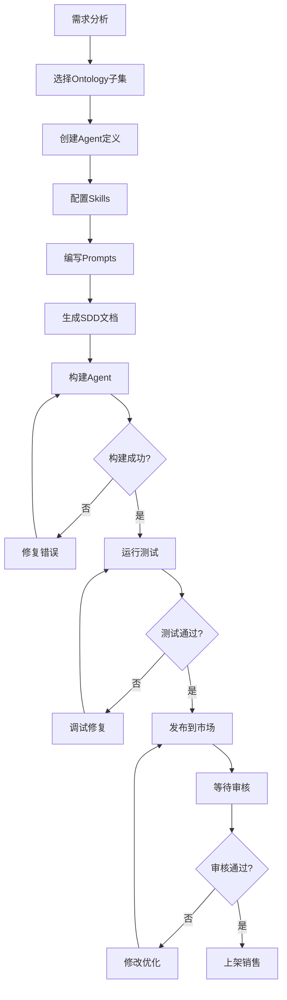
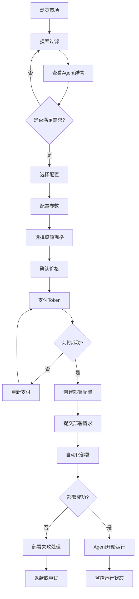
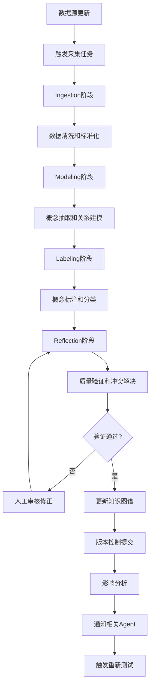
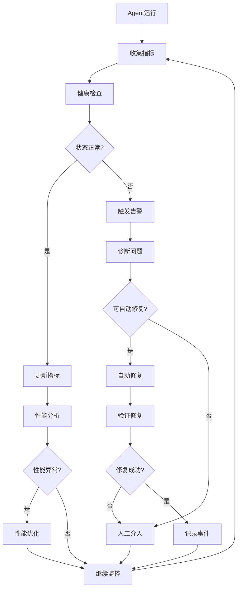
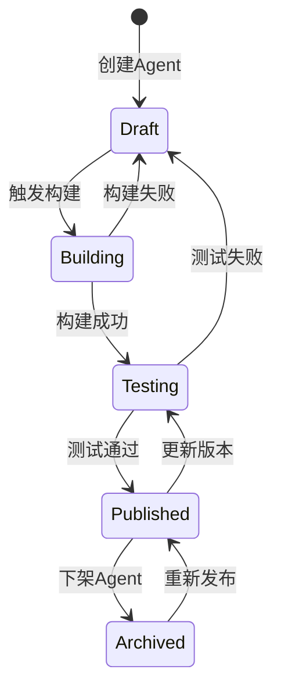
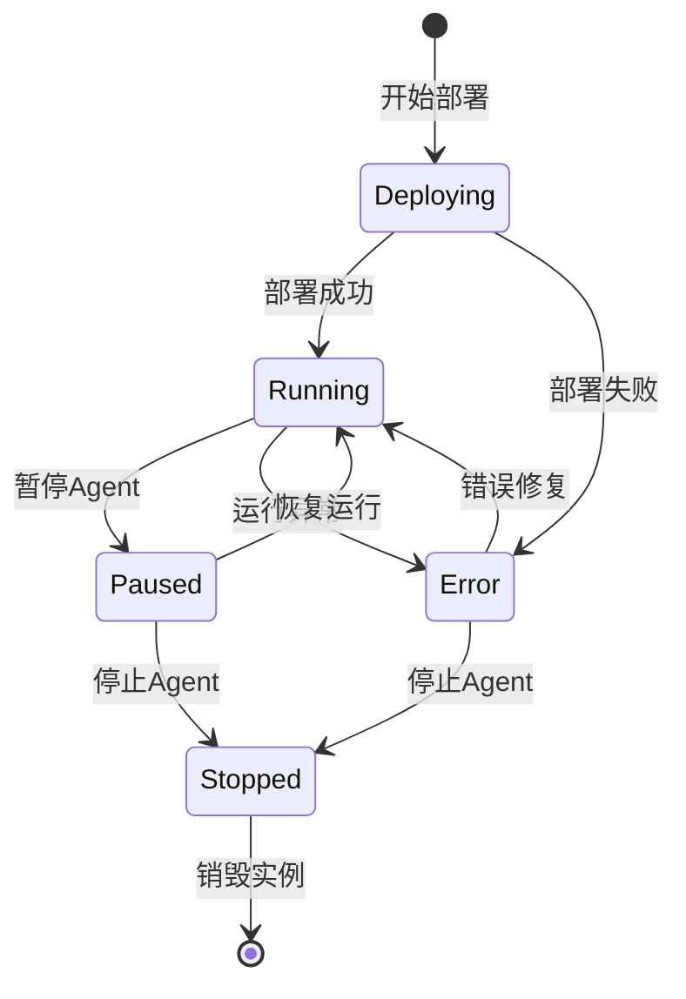
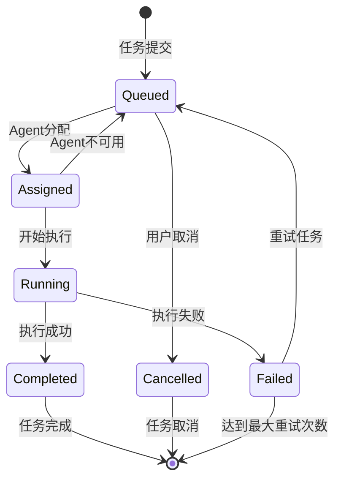

# Agent Factory Platform - 领域分析文档

## 1. 领域概述

### 1.1 业务领域定义

Agent Factory Platform 位于 **企业级 AI 应用管理** 领域，专注于物流行业的智能化转型。该平台采用"就业/HR 隐喻"，将 AI Agent 的生命周期映射为人力资源管理流程，使复杂的技术概念更贴近业务用户的认知模型。

**核心领域边界:**
- **Agent 生命周期管理**: 从创建、发布到部署、监控的完整流程
- **知识图谱管理**: 物流行业领域知识的结构化表示和维护
- **市场化交易**: Agent 作为数字资产的发布、发现和采购
- **运行时治理**: 生产环境中的 Agent 监控、调度和安全管控

### 1.2 业务价值主张

**对 IT 管理者:**
- 降低 AI 应用开发的技术门槛
- 提供统一的 AI 资产管理平台
- 实现 AI 应用的标准化和规模化部署

**对领域专家:**
- 通过可视化界面参与 AI Agent 设计
- 将业务知识转化为可执行的智能应用
- 快速验证和迭代业务假设

**对开发者:**
- 提供结构化的 Agent 开发框架
- 复用现有知识图谱和组件库
- 简化测试、部署和运维流程

**对运维人员:**
- 统一的监控和治理界面
- 自动化的资源调度和故障恢复
- 完善的审计和合规机制

## 2. 核心领域实体分析

### 2.1 聚合根（Aggregate Roots）

#### 2.1.1 Agent（代理）
**聚合根**: `AgentDefinition`

**业务含义**: Agent 是平台的核心资产，代表一个具有特定能力的智能代理，能够自主执行业务任务。

**关键不变量**:
- 每个 Agent 必须关联至少一个 Ontology 子集
- Agent 状态变更必须遵循状态机约束
- 发布的 Agent 必须通过完整的测试验证

**聚合内实体**:
- `SkillConfiguration`: Agent 的技能配置
- `PromptConfiguration`: Agent 的提示词模板
- `BuildConfiguration`: Agent 的构建配置
- `TestConfiguration`: Agent 的测试配置

**边界**: Agent 聚合包含其完整的定义和配置信息，但不包含运行时状态

#### 2.1.2 Ontology（本体）
**聚合根**: `OntologyDomain`

**业务含义**: Ontology 代表特定业务领域的知识结构，是 Agent 智能行为的知识基础。

**关键不变量**:
- 知识图谱必须保持逻辑一致性
- 概念和关系的变更必须维护版本历史
- 数据采集过程必须遵循四阶段流程

**聚合内实体**:
- `Concept`: 领域概念定义
- `Relation`: 概念间关系
- `IngestionStatus`: 数据采集状态
- `OntologyVersion`: 版本管理

**边界**: Ontology 聚合包含知识图谱的结构定义和元数据，但不包含具体的实例数据

#### 2.1.3 Deployment（部署）
**聚合根**: `AgentDeployment`

**业务含义**: Deployment 代表 Agent 在生产环境中的运行实例，包含资源分配和运行状态。

**关键不变量**:
- 部署实例必须关联有效的 Agent 定义
- 资源使用不能超过分配限制
- 健康检查必须定期执行

**聚合内实体**:
- `ResourceUsage`: 资源使用情况
- `HealthStatus`: 健康检查结果
- `PerformanceMetrics`: 性能指标

**边界**: Deployment 聚合包含运行时状态和监控数据，但不包含 Agent 的定义信息

#### 2.1.4 Marketplace（市场）
**聚合根**: `MarketplaceAgent`

**业务含义**: MarketplaceAgent 代表在市场中发布的 Agent，包含商业化信息和交易状态。

**关键不变量**:
- 只有通过验证的 Agent 才能发布到市场
- 定价信息必须符合业务规则
- 交易过程必须可追溯和审计

**聚合内实体**:
- `HiringTransaction`: 雇佣交易
- `AgentConfiguration`: Agent 配置
- `PaymentDetails`: 支付详情

**边界**: Marketplace 聚合包含商业化信息和交易流程，但不包含 Agent 的技术实现细节

### 2.2 实体（Entities）

#### 2.2.1 User（用户）
**身份**: 平台使用者，具有不同角色和权限

**属性**:
- 用户标识、基本信息
- 角色分配（IT管理者/领域专家/开发者/运维人员）
- 权限配置和访问控制

**行为**:
- 登录认证和会话管理
- 角色切换和权限验证
- 操作审计和行为跟踪

#### 2.2.2 Task（任务）
**身份**: 由 Job Agency 调度的工作单元

**属性**:
- 任务定义、输入输出规范
- 优先级和调度策略
- 执行状态和结果记录

**行为**:
- 任务分发和Agent匹配
- 执行监控和状态更新
- 异常处理和重试机制

#### 2.2.3 Message（消息）
**身份**: Message Board 中的通信单元

**属性**:
- 消息内容和元数据
- 发送者信息和目标频道
- 时间戳和优先级

**行为**:
- 消息路由和分发
- 格式化和渲染
- 归档和检索

### 2.3 值对象（Value Objects）

#### 2.3.1 AgentStatus（代理状态）
**值**: `'draft' | 'building' | 'testing' | 'published' | 'archived'`

**业务含义**: 表示 Agent 在生命周期中的当前阶段

**不变量**: 状态变更必须遵循定义的状态机规则

#### 2.3.2 IngestionStage（采集阶段）
**值**: `'ingestion' | 'modeling' | 'labeling' | 'reflection'`

**业务含义**: 表示知识采集过程的四个标准阶段

**不变量**: 阶段必须按顺序进行，不能跳跃

#### 2.3.3 DeploymentStatus（部署状态）
**值**: `'deploying' | 'running' | 'paused' | 'stopped' | 'error'`

**业务含义**: 表示 Agent 部署实例的运行状态

**不变量**: 状态变更必须对应实际的系统操作

#### 2.3.4 Price（价格）
**属性**: `{ amount: number, currency: string, model: string }`

**业务含义**: 表示 Agent 的定价信息

**不变量**: 金额必须为正数，币种必须为支持的类型

#### 2.3.5 ResourceQuota（资源配额）
**属性**: `{ cpu: string, memory: string, storage: string }`

**业务含义**: 表示资源分配和使用限制

**不变量**: 资源值必须符合 Kubernetes 资源规格

## 3. 业务流程分析

### 3.1 Agent 开发流程



**关键节点分析**:

1. **需求分析**: 确定 Agent 要解决的业务问题和目标用户
2. **Ontology 选择**: 基于业务需求选择相关的知识域子集
3. **Agent 定义**: 创建 Agent 的基本信息和元数据
4. **Skills 配置**: 定义 Agent 的能力和技能集合
5. **Prompts 编写**: 设计 Agent 的对话模板和指令
6. **SDD 生成**: 自动生成软件设计文档
7. **构建过程**: 编译和打包 Agent 组件
8. **测试验证**: 运行自动化测试和人工验收
9. **发布审核**: 提交到市场并等待质量审核
10. **上架销售**: 通过审核后正式发布

**业务规则**:
- 每个 Agent 必须关联明确的 Ontology 子集
- 构建过程必须无错误才能进入测试阶段
- 测试覆盖率必须达到80%以上
- 发布前必须通过安全扫描和质量检查

### 3.2 Agent 雇佣流程



**关键节点分析**:

1. **市场浏览**: 用户在 MarketPlace 中发现合适的 Agent
2. **需求匹配**: 评估 Agent 能力与业务需求的匹配度
3. **配置定制**: 根据具体场景调整 Agent 参数
4. **资源规划**: 选择适当的计算资源配置
5. **成本确认**: 确认月度费用和资源成本
6. **Token 支付**: 使用平台 Token 完成支付
7. **部署准备**: 创建部署配置和环境设置
8. **自动部署**: 系统自动完成 Agent 实例化
9. **运行监控**: 持续监控 Agent 运行状态和性能

**业务规则**:
- 用户必须有足够的 Token 余额才能购买
- Agent 配置必须在允许的参数范围内
- 资源分配不能超过用户的配额限制
- 部署失败时自动触发退款流程

### 3.3 知识图谱更新流程



**关键节点分析**:

1. **数据源监控**: 检测外部数据源的更新事件
2. **采集触发**: 自动或手动启动数据采集流程
3. **四阶段处理**: 按照标准流程处理原始数据
4. **质量控制**: 多层次的数据质量验证机制
5. **冲突解决**: 处理新旧数据间的不一致问题
6. **版本管理**: 维护知识图谱的版本历史
7. **影响分析**: 评估变更对现有 Agent 的影响
8. **通知机制**: 及时通知相关方进行必要调整

**业务规则**:
- 知识图谱更新必须经过完整的四阶段处理
- 任何变更都必须保留版本历史
- 影响到现有 Agent 的变更需要发送通知
- 关键概念的删除需要人工审批

### 3.4 运行时监控流程



**关键节点分析**:

1. **指标收集**: 实时采集Agent的运行指标
2. **健康评估**: 基于多维度指标评估Agent健康状态
3. **异常检测**: 识别性能异常和故障情况
4. **自动修复**: 对常见问题执行自动修复策略
5. **人工干预**: 复杂问题需要运维人员介入
6. **事件记录**: 记录所有重要事件用于审计分析
7. **性能优化**: 基于历史数据进行性能调优
8. **持续监控**: 维持7×24小时的监控状态

**业务规则**:
- 健康检查间隔不超过30秒
- 关键指标异常时必须在1分钟内告警
- 自动修复失败后必须立即转为人工处理
- 所有操作都必须记录审计日志

## 4. 状态机设计

### 4.1 Agent 状态机



**状态定义**:
- **Draft**: 草稿状态，Agent 正在开发中
- **Building**: 构建状态，系统正在编译Agent组件
- **Testing**: 测试状态，正在执行自动化测试
- **Published**: 已发布状态，Agent可在市场中购买
- **Archived**: 已归档状态，Agent不再可用

**转换条件**:
- `Draft → Building`: 开发者触发构建操作
- `Building → Testing`: 构建过程无错误完成
- `Testing → Published`: 所有测试用例通过
- `Published → Archived`: 管理员下架或开发者主动归档
- `Archived → Published`: 重新审核通过

### 4.2 部署状态机



**状态定义**:
- **Deploying**: 部署中，系统正在创建Agent实例
- **Running**: 运行中，Agent正常提供服务
- **Paused**: 已暂停，Agent暂时停止处理请求
- **Stopped**: 已停止，Agent实例已关闭
- **Error**: 错误状态，Agent遇到严重问题

**转换触发**:
- 用户操作（暂停、恢复、停止）
- 系统事件（部署完成、错误发生）
- 自动化策略（健康检查失败、资源不足）

### 4.3 任务状态机



**状态定义**:
- **Queued**: 排队中，等待Agent分配
- **Assigned**: 已分配，Agent准备执行
- **Running**: 执行中，Agent正在处理任务
- **Completed**: 已完成，任务成功执行
- **Failed**: 已失败，任务执行出错
- **Cancelled**: 已取消，用户主动取消

## 5. 领域事件定义

### 5.1 Agent 相关事件

#### AgentCreated（Agent已创建）
```typescript
interface AgentCreated {
  eventId: string;
  timestamp: Date;
  agentId: string;
  agentName: string;
  creator: string;
  ontologySubset: string[];
}
```

**触发条件**: 用户成功创建新的Agent定义
**业务影响**: 触发初始构建流程，发送通知给相关用户

#### AgentPublished（Agent已发布）
```typescript
interface AgentPublished {
  eventId: string;
  timestamp: Date;
  agentId: string;
  agentName: string;
  version: string;
  pricing: PriceInfo;
  categories: string[];
}
```

**触发条件**: Agent通过所有测试并成功发布到市场
**业务影响**: 更新市场目录，发送推广通知，触发指标统计

#### AgentDeprecated（Agent已弃用）
```typescript
interface AgentDeprecated {
  eventId: string;
  timestamp: Date;
  agentId: string;
  reason: string;
  replacementAgent?: string;
  affectedDeployments: string[];
}
```

**触发条件**: Agent由于各种原因被标记为弃用
**业务影响**: 通知现有用户，停止新部署，制定迁移计划

### 5.2 Ontology 相关事件

#### OntologyUpdated（知识图谱已更新）
```typescript
interface OntologyUpdated {
  eventId: string;
  timestamp: Date;
  ontologyId: string;
  version: string;
  changeType: 'concepts' | 'relations' | 'metadata';
  affectedAgents: string[];
  changeDescription: string;
}
```

**触发条件**: 知识图谱结构发生重要变更
**业务影响**: 通知相关Agent，触发兼容性检查，可能需要重新测试

#### IngestionCompleted（数据采集已完成）
```typescript
interface IngestionCompleted {
  eventId: string;
  timestamp: Date;
  ontologyId: string;
  stage: IngestionStage;
  success: boolean;
  processedRecords: number;
  errorCount: number;
  nextStage?: IngestionStage;
}
```

**触发条件**: 知识采集的某个阶段完成
**业务影响**: 自动进入下一阶段，更新进度状态，记录质量指标

### 5.3 Runtime 相关事件

#### AgentDeployed（Agent已部署）
```typescript
interface AgentDeployed {
  eventId: string;
  timestamp: Date;
  deploymentId: string;
  agentId: string;
  agentVersion: string;
  environment: string;
  resourceAllocation: ResourceQuota;
  owner: string;
}
```

**触发条件**: Agent实例成功部署到运行环境
**业务影响**: 开始监控，记录资源使用，发送部署通知

#### AgentHealthChanged（Agent健康状态变更）
```typescript
interface AgentHealthChanged {
  eventId: string;
  timestamp: Date;
  deploymentId: string;
  previousStatus: HealthStatus;
  currentStatus: HealthStatus;
  reason?: string;
  autoRecoveryAttempted: boolean;
}
```

**触发条件**: Agent健康检查状态发生变化
**业务影响**: 触发告警或恢复流程，记录运维事件，通知相关人员

#### TaskCompleted（任务已完成）
```typescript
interface TaskCompleted {
  eventId: string;
  timestamp: Date;
  taskId: string;
  agentId: string;
  deploymentId: string;
  status: 'success' | 'failure';
  duration: number;
  resourceUsed: ResourceUsage;
  output?: unknown;
  errorMessage?: string;
}
```

**触发条件**: Agent完成任务执行
**业务影响**: 更新任务状态，记录性能指标，触发后续流程

### 5.4 Marketplace 相关事件

#### AgentPurchased（Agent已购买）
```typescript
interface AgentPurchased {
  eventId: string;
  timestamp: Date;
  transactionId: string;
  agentId: string;
  buyer: string;
  price: PriceInfo;
  configuration: AgentConfiguration;
  deploymentScheduled: Date;
}
```

**触发条件**: 用户成功购买Agent并完成支付
**业务影响**: 触发自动部署流程，更新销售统计，发送购买确认

#### PaymentProcessed（支付已处理）
```typescript
interface PaymentProcessed {
  eventId: string;
  timestamp: Date;
  transactionId: string;
  amount: number;
  currency: string;
  method: string;
  status: 'success' | 'failure';
  buyer: string;
  seller: string;
}
```

**触发条件**: 支付系统处理完成支付请求
**业务影响**: 更新账户余额，触发服务开通或退款流程

## 6. 领域服务设计

### 6.1 Agent构建服务（AgentBuildService）

**职责**: 负责Agent的构建、编译和打包流程

**核心方法**:
```typescript
interface AgentBuildService {
  // 触发构建流程
  triggerBuild(agentId: string): Promise<BuildConfiguration>;
  
  // 监控构建状态
  getBuildStatus(buildId: string): Promise<BuildStatus>;
  
  // 获取构建日志
  getBuildLogs(buildId: string): Promise<BuildLog[]>;
  
  // 取消构建
  cancelBuild(buildId: string): Promise<void>;
  
  // 清理构建产物
  cleanupBuild(buildId: string): Promise<void>;
}
```

**业务规则**:
- 构建前验证Agent定义的完整性
- 并发构建数量限制
- 构建超时自动取消
- 保留构建历史记录

### 6.2 知识图谱同步服务（OntologySync Service）

**职责**: 管理知识图谱的版本控制和同步

**核心方法**:
```typescript
interface OntologySyncService {
  // 同步知识图谱
  syncOntology(ontologyId: string, source: DataSource): Promise<void>;
  
  // 检查版本冲突
  checkVersionConflict(ontologyId: string, newVersion: string): Promise<ConflictResult>;
  
  // 合并变更
  mergeChanges(ontologyId: string, changes: Change[]): Promise<MergeResult>;
  
  // 回滚版本
  rollbackVersion(ontologyId: string, targetVersion: string): Promise<void>;
  
  // 计算影响范围
  calculateImpact(ontologyId: string, changes: Change[]): Promise<ImpactAnalysis>;
}
```

**业务规则**:
- 变更必须经过冲突检测
- 回滚操作需要管理员权限
- 影响分析必须通知相关Agent所有者

### 6.3 智能匹配服务（IntelligentMatching Service）

**职责**: 负责任务与Agent的智能匹配和调度

**核心方法**:
```typescript
interface IntelligentMatchingService {
  // 匹配最适合的Agent
  findBestMatch(task: Task): Promise<MatchResult>;
  
  // 评估Agent能力
  evaluateCapability(agentId: string, requirements: Requirement[]): Promise<CapabilityScore>;
  
  // 负载均衡分配
  balanceLoad(candidateAgents: string[], task: Task): Promise<string>;
  
  // 预测执行时间
  predictExecutionTime(agentId: string, task: Task): Promise<number>;
  
  // 优化资源分配
  optimizeResourceAllocation(tasks: Task[]): Promise<AllocationPlan>;
}
```

**业务规则**:
- 优先考虑Agent能力匹配度
- 平衡负载分配避免单点过载
- 考虑成本效益比
- 维护历史性能数据用于预测

### 6.4 安全治理服务（SecurityGovernanceService）

**职责**: 管理平台的安全策略和合规检查

**核心方法**:
```typescript
interface SecurityGovernanceService {
  // 验证权限
  checkPermission(userId: string, resource: string, action: string): Promise<boolean>;
  
  // 记录审计日志
  recordAuditLog(event: AuditEvent): Promise<void>;
  
  // 检测异常行为
  detectAnomalousActivity(userId: string, activities: Activity[]): Promise<AnomalyReport>;
  
  // 应用安全策略
  applySecurityPolicy(policyId: string, target: string): Promise<void>;
  
  // 生成合规报告
  generateComplianceReport(timeRange: TimeRange): Promise<ComplianceReport>;
}
```

**业务规则**:
- 所有操作都必须记录审计日志
- 异常行为自动触发安全检查
- 敏感操作需要多重验证
- 合规报告定期生成并存档

## 7. 领域边界和上下文映射

### 7.1 领域边界定义

**Agent Factory 核心域**:
- Agent 生命周期管理
- 知识图谱维护
- 构建和测试流程

**Marketplace 子域**:
- Agent 发布和发现
- 交易和支付处理
- 用户评价和反馈

**Runtime 监控域**:
- 部署和运维管理
- 性能监控和告警
- 资源调度和优化

**安全治理域**:
- 身份认证和授权
- 审计和合规管理
- 安全策略执行

### 7.2 上下文映射关系

```
┌─────────────────┐    Published Agent Data    ┌─────────────────┐
│   Agent Factory │ ──────────────────────────→ │   Marketplace   │
│     Context     │                             │    Context      │
└─────────────────┘                             └─────────────────┘
         │                                               │
         │ Agent Definition                              │ Deployment Request
         │                                               │
         ▼                                               ▼
┌─────────────────┐    Deployment Config        ┌─────────────────┐
│  Runtime Monitor │ ←──────────────────────────  │  Security Gov   │
│    Context      │                             │    Context      │
└─────────────────┘                             └─────────────────┘
```

**映射关系说明**:

1. **Agent Factory → Marketplace**: 发布完成的Agent定义和元数据
2. **Marketplace → Runtime**: 传递用户的部署请求和配置信息
3. **Runtime → Security**: 所有运行时操作都需要安全检查和审计
4. **Security → All Contexts**: 提供统一的认证授权和审计服务

### 7.3 反腐败层设计

为了保护各个领域的纯净性，在边界处设计反腐败层：

**Agent Factory ACL**:
- 将外部的部署状态映射为内部的Agent状态
- 过滤掉运行时的技术细节，只关注Agent本身的定义

**Marketplace ACL**:
- 将Agent的技术定义转换为市场友好的展示信息
- 屏蔽内部构建过程的复杂性

**Runtime ACL**:
- 将Agent定义转换为实际的部署配置
- 抽象底层基础设施的差异

**Security ACL**:
- 统一不同上下文的权限模型
- 标准化审计事件格式

---

*本领域分析文档深入分析了 Agent Factory Platform 的业务领域，为技术实现提供了清晰的业务逻辑指导。*