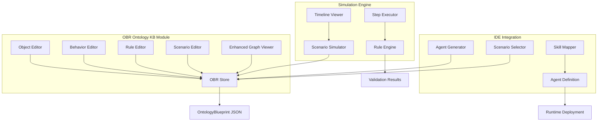

# Agent Factory Platform - OBR 系统设计文档

## 1. 系统架构设计

### 1.1 OBR 架构概览

```
┌─────────────────────────────────────────────────────────────────┐
│                    OBR Enhanced Architecture                    │
└─────────────────────────────────────────────────────────────────┘
                                 │
        ┌─────────────────────────────────────────────┐
        │            OBR Modeling Layer               │
        │  ┌─────────┐ ┌─────────┐ ┌─────────┐ ┌──────┐│
        │  │Objects  │ │Behaviors│ │  Rules  │ │Scene-││
        │  │ Editor  │ │ Editor  │ │ Editor  │ │ rios ││
        │  └─────────┘ └─────────┘ └─────────┘ └──────┘│
        └─────────────────────────────────────────────┘
                                 │
        ┌─────────────────────────────────────────────┐
        │            Simulation Engine                │
        │  ┌─────────┐ ┌─────────┐ ┌─────────┐ ┌──────┐│
        │  │ Scene   │ │  Step   │ │  Rule   │ │Visual││
        │  │ Select  │ │ Execute │ │ Engine  │ │Timeline││
        │  └─────────┘ └─────────┘ └─────────┘ └──────┘│
        └─────────────────────────────────────────────┘
                                 │
        ┌─────────────────────────────────────────────┐
        │        Enhanced React Flow Graph           │
        │  ┌─────────┐ ┌─────────┐ ┌─────────┐ ┌──────┐│
        │  │   OBR   │ │   12    │ │  Force  │ │ Node ││
        │  │  Nodes  │ │ Semantic│ │Directed │ │Detail││
        │  │         │ │  Edges  │ │ Layout  │ │Panel ││
        │  └─────────┘ └─────────┘ └─────────┘ └──────┘│
        └─────────────────────────────────────────────┘
                                 │
        ┌─────────────────────────────────────────────┐
        │            Data Management                  │
        │  ┌─────────┐ ┌─────────┐ ┌─────────┐ ┌──────┐│
        │  │ OBR     │ │ Schema  │ │ Version │ │Import││
        │  │ Store   │ │Validator│ │ Control │ │Export││
        │  └─────────┘ └─────────┘ └─────────┘ └──────┘│
        └─────────────────────────────────────────────┘
                                 │
        ┌─────────────────────────────────────────────┐
        │          IDE Integration Layer              │
        │  ┌─────────┐ ┌─────────┐ ┌─────────┐ ┌──────┐│
        │  │Scenario │ │  Agent  │ │  Skill  │ │Prompt││
        │  │to Agent │ │Generator│ │ Mapper  │ │Gen   ││
        │  └─────────┘ └─────────┘ └─────────┘ └──────┘│
        └─────────────────────────────────────────────┘
```

### 1.2 核心模块交互设计



## 2. 数据模型设计

### 2.1 OntologyBlueprint JSON Schema

```typescript
// 核心 OBR 数据模型
interface OntologyBlueprint {
  $schema: 'https://schemas.agent-factory.com/obr/v1.0.0';
  metadata: {
    id: string;
    name: string;
    version: string;
    domain: string;
    description: string;
    author: string;
    createdAt: string;
    updatedAt: string;
    checksum: string;
    dependencies?: string[];
  };
  objects: OBRObject[];
  behaviors: OBRBehavior[];
  rules: OBRRule[];
  scenarios: OBRScenario[];
  links: OBRLink[];
  validation?: ValidationResult;
}

// 业务对象定义
interface OBRObject {
  id: string;
  name: string;
  displayName: string;
  description: string;
  category: 'entity' | 'value_object' | 'aggregate' | 'service';
  
  // 属性定义
  attributes: {
    [key: string]: {
      type: 'string' | 'number' | 'boolean' | 'date' | 'enum' | 'reference';
      required: boolean;
      defaultValue?: any;
      constraints?: {
        min?: number;
        max?: number;
        pattern?: string;
        enum?: string[];
        references?: string; // 引用的对象 ID
      };
      description?: string;
    };
  };
  
  // 状态机定义
  stateMachine?: {
    initialState: string;
    states: {
      [stateName: string]: {
        displayName: string;
        description?: string;
        isTerminal?: boolean;
      };
    };
    transitions: {
      from: string;
      to: string;
      trigger: string; // 触发的行为 ID
      condition?: string; // 条件表达式
    }[];
  };
  
  // 业务约束
  constraints: {
    id: string;
    type: 'invariant' | 'precondition' | 'postcondition';
    expression: string;
    description: string;
    severity: 'error' | 'warning' | 'info';
  }[];
  
  // 可视化属性
  visual: {
    position?: { x: number; y: number };
    color?: string;
    icon?: string;
    size?: 'small' | 'medium' | 'large';
  };
}

// 行为操作定义
interface OBRBehavior {
  id: string;
  name: string;
  displayName: string;
  description: string;
  category: 'command' | 'query' | 'event' | 'workflow';
  
  // 前置条件
  preconditions: {
    objectStates: { objectId: string; requiredState: string }[];
    ruleChecks: string[]; // 规则 ID 列表
    customConditions: string[]; // 自定义条件表达式
  };
  
  // 输入参数
  inputs: {
    [paramName: string]: {
      type: string;
      required: boolean;
      validation?: string;
      description?: string;
    };
  };
  
  // 输出结果
  outputs: {
    [paramName: string]: {
      type: string;
      description?: string;
    };
  };
  
  // 状态变更
  stateChanges: {
    objectId: string;
    newState: string;
    condition?: string;
  }[];
  
  // 关联规则
  linkedRules: {
    ruleId: string;
    phase: 'before' | 'during' | 'after';
    required: boolean;
  }[];
  
  // 副作用
  sideEffects: {
    type: 'create' | 'update' | 'delete' | 'notify';
    target: string;
    data?: any;
  }[];
  
  // 可视化属性
  visual: {
    position?: { x: number; y: number };
    color?: string;
    icon?: string;
  };
}

// 业务规则定义
interface OBRRule {
  id: string;
  name: string;
  displayName: string;
  description: string;
  category: 'invariant' | 'trigger' | 'validation' | 'constraint';
  priority: number; // 1-10, 数字越大优先级越高
  
  // 规则条件
  condition: {
    expression: string; // 形式化表达式
    naturalLanguage: string; // 自然语言描述
    variables: { [name: string]: string }; // 变量定义
  };
  
  // 规则动作
  actions: {
    type: 'validate' | 'block' | 'warn' | 'execute' | 'notify';
    target?: string;
    message?: string;
    severity: 'error' | 'warning' | 'info';
    data?: any;
  }[];
  
  // 适用范围
  scope: {
    objects: string[]; // 适用的对象 ID
    behaviors: string[]; // 适用的行为 ID
    scenarios: string[]; // 适用的场景 ID
  };
  
  // 冲突处理
  conflicts?: {
    ruleId: string;
    resolution: 'override' | 'merge' | 'error';
    description: string;
  }[];
  
  // 测试用例
  testCases?: {
    id: string;
    description: string;
    input: any;
    expectedResult: 'pass' | 'fail';
    actualResult?: 'pass' | 'fail';
  }[];
}

// 场景编排定义
interface OBRScenario {
  id: string;
  name: string;
  displayName: string;
  description: string;
  category: 'process' | 'workflow' | 'event_handling' | 'decision_flow';
  
  // 场景参与者
  actors: {
    id: string;
    name: string;
    role: string;
    permissions: string[];
  }[];
  
  // 场景步骤
  steps: {
    id: string;
    name: string;
    type: 'start' | 'end' | 'task' | 'decision' | 'parallel' | 'merge';
    
    // 任务定义
    task?: {
      behaviorId: string;
      actorId?: string;
      inputs: { [key: string]: any };
      timeout?: number;
    };
    
    // 决策定义
    decision?: {
      condition: string;
      branches: { condition: string; nextStepId: string }[];
    };
    
    // 并行定义
    parallel?: {
      branches: string[][]; // 并行分支的步骤 ID 数组
      syncType: 'all' | 'any' | 'first';
    };
    
    // 流程控制
    next: string | string[]; // 下一步骤 ID
    
    // 可视化
    visual: {
      position: { x: number; y: number };
      type: 'bpmn' | 'flowchart';
    };
  }[];
  
  // 触发条件
  triggers: {
    type: 'manual' | 'event' | 'schedule' | 'condition';
    condition?: string;
    event?: string;
    schedule?: string;
  }[];
  
  // 场景约束
  constraints: {
    timeLimit?: number;
    resourceLimits?: { [resource: string]: number };
    businessRules: string[]; // 规则 ID 列表
  };
  
  // 性能指标
  metrics?: {
    averageDuration?: number;
    successRate?: number;
    errorPatterns?: string[];
  };
}

// 语义链接定义
interface OBRLink {
  id: string;
  sourceId: string;
  targetId: string;
  sourceType: 'object' | 'behavior' | 'rule' | 'scenario';
  targetType: 'object' | 'behavior' | 'rule' | 'scenario';
  
  // 12 种语义关系类型
  relationshipType: 
    | 'is_a'           // 继承关系
    | 'part_of'        // 组成关系
    | 'depends_on'     // 依赖关系
    | 'triggers'       // 触发关系
    | 'precedes'       // 前置关系
    | 'conflicts_with' // 冲突关系
    | 'implements'     // 实现关系
    | 'validates'      // 验证关系
    | 'aggregates'     // 聚合关系
    | 'uses'           // 使用关系
    | 'produces'       // 产生关系
    | 'consumes';      // 消费关系
  
  // 关系属性
  properties: {
    weight?: number; // 关系强度 0-1
    direction?: 'unidirectional' | 'bidirectional';
    multiplicity?: '1:1' | '1:N' | 'N:N';
    constraints?: string[];
  };
  
  description?: string;
  
  // 可视化属性
  visual: {
    style?: 'solid' | 'dashed' | 'dotted';
    color?: string;
    width?: number;
    label?: string;
  };
}

// 验证结果
interface ValidationResult {
  isValid: boolean;
  timestamp: string;
  errors: ValidationError[];
  warnings: ValidationWarning[];
  metrics: {
    objectCount: number;
    behaviorCount: number;
    ruleCount: number;
    scenarioCount: number;
    linkCount: number;
    completenessScore: number; // 0-100
    consistencyScore: number;  // 0-100
  };
}

interface ValidationError {
  code: string;
  type: 'schema' | 'semantic' | 'consistency';
  path: string;
  message: string;
  severity: 'error' | 'warning';
  suggestions?: string[];
}

interface ValidationWarning {
  code: string;
  type: 'best_practice' | 'performance' | 'maintainability';
  path: string;
  message: string;
  suggestions?: string[];
}
```

### 2.2 HRM 领域模型实现

```typescript
// HRM 领域的完整 OBR 模型
const HRM_ONTOLOGY_BLUEPRINT: OntologyBlueprint = {
  $schema: 'https://schemas.agent-factory.com/obr/v1.0.0',
  metadata: {
    id: 'hrm-domain-v1',
    name: 'Human Resource Management Ontology',
    version: '1.0.0',
    domain: 'HRM',
    description: '人力资源管理完整业务域本体模型',
    author: 'Agent Factory Team',
    createdAt: '2024-03-22T00:00:00Z',
    updatedAt: '2024-03-22T00:00:00Z',
    checksum: 'sha256:...'
  },
  
  // 8 个核心对象
  objects: [
    {
      id: 'employee',
      name: 'Employee',
      displayName: '员工',
      description: '组织中的员工实体，包含个人信息、技能和状态',
      category: 'entity',
      attributes: {
        id: { type: 'string', required: true, description: '员工唯一标识' },
        name: { type: 'string', required: true, description: '员工姓名' },
        email: { type: 'string', required: true, constraints: { pattern: '^[\\w-\\.]+@([\\w-]+\\.)+[\\w-]{2,4}$' } },
        phone: { type: 'string', required: false },
        department: { type: 'reference', references: 'organization', required: true },
        position: { type: 'string', required: true },
        skills: { type: 'reference', references: 'skill', required: false },
        supervisor: { type: 'reference', references: 'supervisor', required: false },
        startDate: { type: 'date', required: true },
        endDate: { type: 'date', required: false },
        emergencyContact: { type: 'string', required: true }
      },
      stateMachine: {
        initialState: 'active',
        states: {
          'active': { displayName: '在职', description: '正常工作状态' },
          'on_leave': { displayName: '请假', description: '临时离开' },
          'suspended': { displayName: '停职', description: '暂时停止工作' },
          'terminated': { displayName: '离职', description: '结束雇佣关系', isTerminal: true }
        },
        transitions: [
          { from: 'active', to: 'on_leave', trigger: 'requestLeave' },
          { from: 'on_leave', to: 'active', trigger: 'returnFromLeave' },
          { from: 'active', to: 'suspended', trigger: 'suspend' },
          { from: 'suspended', to: 'active', trigger: 'reinstate' },
          { from: 'active', to: 'terminated', trigger: 'terminate' },
          { from: 'suspended', to: 'terminated', trigger: 'terminate' }
        ]
      },
      constraints: [
        {
          id: 'valid_employment_period',
          type: 'invariant',
          expression: 'endDate == null || endDate > startDate',
          description: '离职日期必须晚于入职日期',
          severity: 'error'
        }
      ],
      visual: { color: '#3b82f6', icon: 'user' }
    },
    // ... 其他 7 个对象的完整定义
  ],
  
  // 5 个核心行为
  behaviors: [
    {
      id: 'createShift',
      name: 'createShift',
      displayName: '创建班次',
      description: '创建新的工作班次，包括时间验证和资源检查',
      category: 'command',
      preconditions: {
        objectStates: [
          { objectId: 'organization', requiredState: 'active' }
        ],
        ruleChecks: ['no_time_conflict'],
        customConditions: ['hasPermission(actor, "schedule_management")']
      },
      inputs: {
        startTime: { type: 'date', required: true, description: '班次开始时间' },
        endTime: { type: 'date', required: true, description: '班次结束时间' },
        shiftType: { 
          type: 'enum', 
          required: true, 
          validation: 'in:["morning","afternoon","night","overtime"]',
          description: '班次类型'
        },
        requiredSkills: { type: 'string[]', required: false, description: '所需技能列表' },
        maxEmployees: { type: 'number', required: true, description: '最大员工数' },
        department: { type: 'string', required: true, description: '所属部门' }
      },
      outputs: {
        shiftId: { type: 'string', description: '创建的班次ID' },
        success: { type: 'boolean', description: '创建是否成功' },
        conflicts: { type: 'string[]', description: '检测到的冲突列表' }
      },
      stateChanges: [
        { objectId: 'shift', newState: 'created' }
      ],
      linkedRules: [
        { ruleId: 'min_rest_8h', phase: 'before', required: true },
        { ruleId: 'max_consecutive_12h', phase: 'during', required: true }
      ],
      sideEffects: [
        { type: 'notify', target: 'supervisor', data: { event: 'shift_created' } }
      ],
      visual: { color: '#22c55e', icon: 'calendar-plus' }
    }
    // ... 其他 4 个行为的完整定义
  ],
  
  // 4 个核心规则
  rules: [
    {
      id: 'min_rest_8h',
      name: 'minimumRest8Hours',
      displayName: '最少休息8小时',
      description: '员工连续班次之间必须有至少8小时的休息时间',
      category: 'invariant',
      priority: 9,
      condition: {
        expression: 'timeDiff(previousShift.endTime, currentShift.startTime) >= 8 * 3600000',
        naturalLanguage: '当前班次开始时间与上个班次结束时间之间至少相隔8小时',
        variables: {
          'previousShift.endTime': 'Date',
          'currentShift.startTime': 'Date'
        }
      },
      actions: [
        {
          type: 'block',
          message: '违反最少休息时间规定，员工需要至少8小时休息',
          severity: 'error'
        }
      ],
      scope: {
        objects: ['employee', 'shift', 'schedule'],
        behaviors: ['createShift', 'assignEmployee'],
        scenarios: ['normal_scheduling', 'emergency_substitution']
      },
      testCases: [
        {
          id: 'test_valid_rest',
          description: '正常8小时休息',
          input: { previousEnd: '2024-03-22T22:00:00Z', currentStart: '2024-03-23T08:00:00Z' },
          expectedResult: 'pass'
        },
        {
          id: 'test_insufficient_rest',
          description: '休息不足8小时',
          input: { previousEnd: '2024-03-22T22:00:00Z', currentStart: '2024-03-23T04:00:00Z' },
          expectedResult: 'fail'
        }
      ]
    }
    // ... 其他 3 个规则的完整定义
  ],
  
  // 3 个核心场景
  scenarios: [
    {
      id: 'normal_scheduling',
      name: 'normalScheduling',
      displayName: '正常排班流程',
      description: '标准的员工排班业务流程',
      category: 'process',
      actors: [
        { id: 'scheduler', name: '排班员', role: 'operator', permissions: ['schedule_read', 'schedule_write'] },
        { id: 'supervisor', name: '主管', role: 'approver', permissions: ['schedule_approve'] }
      ],
      steps: [
        {
          id: 'start',
          name: '开始排班',
          type: 'start',
          next: 'analyze_demand',
          visual: { position: { x: 100, y: 100 }, type: 'bpmn' }
        },
        {
          id: 'analyze_demand',
          name: '分析需求',
          type: 'task',
          task: {
            behaviorId: 'analyzeDemand',
            actorId: 'scheduler',
            inputs: { period: 'next_week', department: 'all' },
            timeout: 300000
          },
          next: 'match_skills',
          visual: { position: { x: 200, y: 100 }, type: 'bpmn' }
        },
        {
          id: 'match_skills',
          name: '技能匹配',
          type: 'task',
          task: {
            behaviorId: 'matchSkills',
            actorId: 'scheduler',
            inputs: { requirements: '${analyze_demand.requirements}' }
          },
          next: 'create_shifts',
          visual: { position: { x: 300, y: 100 }, type: 'bpmn' }
        }
        // ... 更多步骤
      ],
      triggers: [
        { type: 'schedule', schedule: '0 9 * * 1' }, // 每周一上午9点
        { type: 'manual' }
      ],
      constraints: {
        timeLimit: 7200000, // 2小时
        businessRules: ['min_rest_8h', 'max_consecutive_12h', 'skill_match_80', 'overtime_approval']
      }
    }
    // ... 其他 2 个场景的完整定义
  ],
  
  // 语义链接
  links: [
    {
      id: 'employee_has_skills',
      sourceId: 'employee',
      targetId: 'skill',
      sourceType: 'object',
      targetType: 'object',
      relationshipType: 'uses',
      properties: { multiplicity: '1:N', direction: 'unidirectional' },
      description: '员工具备多种技能',
      visual: { style: 'solid', color: '#6b7280', width: 2 }
    }
    // ... 更多语义链接
  ]
};
```

## 3. 组件设计

### 3.1 OBR 编辑器组件树

```
src/features/ontology/components/obr/
├── editors/
│   ├── ObjectEditor/
│   │   ├── ObjectEditor.tsx                 # 主编辑器
│   │   ├── AttributeEditor.tsx             # 属性编辑子组件
│   │   ├── StateMachineEditor.tsx          # 状态机编辑
│   │   ├── ConstraintEditor.tsx            # 约束编辑
│   │   └── ObjectPreview.tsx               # 对象预览
│   ├── BehaviorEditor/
│   │   ├── BehaviorEditor.tsx              # 主编辑器
│   │   ├── PreconditionEditor.tsx          # 前置条件编辑
│   │   ├── InputOutputEditor.tsx           # 输入输出编辑
│   │   ├── StateChangeEditor.tsx           # 状态变更编辑
│   │   └── RuleLinkerEditor.tsx            # 规则关联编辑
│   ├── RuleEditor/
│   │   ├── RuleEditor.tsx                  # 主编辑器
│   │   ├── ConditionEditor.tsx             # 条件编辑
│   │   ├── ActionEditor.tsx                # 动作编辑
│   │   ├── ScopeEditor.tsx                 # 适用范围编辑
│   │   ├── ConflictResolver.tsx            # 冲突解决
│   │   └── TestCaseEditor.tsx              # 测试用例编辑
│   └── ScenarioEditor/
│       ├── ScenarioEditor.tsx              # 主编辑器
│       ├── WorkflowDesigner.tsx            # 工作流设计器
│       ├── StepEditor.tsx                  # 步骤编辑
│       ├── ActorManager.tsx                # 参与者管理
│       ├── TriggerEditor.tsx               # 触发器编辑
│       └── ConstraintEditor.tsx            # 约束编辑
├── viewers/
│   ├── EnhancedGraphViewer.tsx             # 增强的图谱查看器
│   ├── NodeRenderer/
│   │   ├── ObjectNode.tsx                  # 对象节点渲染
│   │   ├── BehaviorNode.tsx               # 行为节点渲染
│   │   ├── RuleNode.tsx                   # 规则节点渲染
│   │   └── ScenarioNode.tsx               # 场景节点渲染
│   ├── EdgeRenderer/
│   │   ├── SemanticEdge.tsx               # 语义边渲染
│   │   └── LinkTypeIndicator.tsx          # 链接类型指示器
│   └── GraphControls/
│       ├── LayerController.tsx             # 图层控制
│       ├── FilterPanel.tsx                # 筛选面板
│       ├── LayoutController.tsx           # 布局控制
│       └── ExportController.tsx           # 导出控制
├── simulation/
│   ├── ScenarioSimulator.tsx              # 场景仿真器
│   ├── StepExecutor.tsx                   # 步骤执行器
│   ├── RuleEngine.tsx                     # 规则引擎
│   ├── Timeline/
│   │   ├── TimelineViewer.tsx             # 时间轴查看器
│   │   ├── StepIndicator.tsx              # 步骤指示器
│   │   ├── ExecutionHistory.tsx           # 执行历史
│   │   └── ProgressTracker.tsx            # 进度追踪
│   └── Visualization/
│       ├── ForceDirectedSimulation.tsx    # 力导向仿真
│       ├── AnimationController.tsx        # 动画控制器
│       ├── NodeAnimator.tsx               # 节点动画器
│       └── EdgeAnimator.tsx               # 边动画器
├── validation/
│   ├── SchemaValidator.tsx                # Schema 验证器
│   ├── SemanticValidator.tsx              # 语义验证器
│   ├── ConsistencyChecker.tsx             # 一致性检查器
│   └── ValidationReporter.tsx             # 验证报告器
└── import-export/
    ├── BlueprintImporter.tsx              # 蓝图导入器
    ├── BlueprintExporter.tsx              # 蓝图导出器
    ├── FormatConverter.tsx                # 格式转换器
    └── MigrationHelper.tsx                # 迁移助手
```

### 3.2 核心组件设计

#### 3.2.1 ObjectEditor 组件

```typescript
interface ObjectEditorProps {
  objectId?: string;
  initialData?: Partial<OBRObject>;
  onSave: (object: OBRObject) => Promise<void>;
  onCancel: () => void;
  readonly?: boolean;
}

export function ObjectEditor({ objectId, initialData, onSave, onCancel, readonly }: ObjectEditorProps) {
  const [object, setObject] = useState<Partial<OBRObject>>(initialData || {});
  const [validationErrors, setValidationErrors] = useState<ValidationError[]>([]);
  const [activeTab, setActiveTab] = useState<'basic' | 'attributes' | 'states' | 'constraints'>('basic');

  // 属性编辑逻辑
  const handleAttributeAdd = useCallback((attribute: ObjectAttribute) => {
    setObject(prev => ({
      ...prev,
      attributes: { ...prev.attributes, [attribute.name]: attribute }
    }));
  }, []);

  // 状态机编辑逻辑
  const handleStateAdd = useCallback((state: ObjectState) => {
    setObject(prev => ({
      ...prev,
      stateMachine: {
        ...prev.stateMachine,
        states: { ...prev.stateMachine?.states, [state.name]: state }
      }
    }));
  }, []);

  // 实时验证
  useEffect(() => {
    const validateObject = async () => {
      const errors = await validateOBRObject(object);
      setValidationErrors(errors);
    };
    validateObject();
  }, [object]);

  return (
    <div className="object-editor">
      <Tabs value={activeTab} onValueChange={setActiveTab}>
        <TabsList>
          <TabsTrigger value="basic">基本信息</TabsTrigger>
          <TabsTrigger value="attributes">属性</TabsTrigger>
          <TabsTrigger value="states">状态机</TabsTrigger>
          <TabsTrigger value="constraints">约束</TabsTrigger>
        </TabsList>
        
        <TabsContent value="basic">
          <BasicInfoEditor object={object} onChange={setObject} />
        </TabsContent>
        
        <TabsContent value="attributes">
          <AttributeEditor 
            attributes={object.attributes || {}} 
            onAdd={handleAttributeAdd}
            onRemove={handleAttributeRemove}
            onUpdate={handleAttributeUpdate}
          />
        </TabsContent>
        
        <TabsContent value="states">
          <StateMachineEditor
            stateMachine={object.stateMachine}
            onChange={handleStateMachineChange}
          />
        </TabsContent>
        
        <TabsContent value="constraints">
          <ConstraintEditor
            constraints={object.constraints || []}
            onChange={handleConstraintsChange}
          />
        </TabsContent>
      </Tabs>
      
      {/* 验证错误显示 */}
      <ValidationPanel errors={validationErrors} />
      
      {/* 操作按钮 */}
      <div className="flex justify-end space-x-2">
        <Button variant="outline" onClick={onCancel}>取消</Button>
        <Button 
          onClick={() => onSave(object as OBRObject)} 
          disabled={validationErrors.some(e => e.severity === 'error')}
        >
          保存
        </Button>
      </div>
    </div>
  );
}
```

#### 3.2.2 ScenarioSimulator 组件

```typescript
interface ScenarioSimulatorProps {
  scenario: OBRScenario;
  ontology: OntologyBlueprint;
  onStepExecuted: (step: SimulationStep) => void;
  onSimulationComplete: (result: SimulationResult) => void;
}

export function ScenarioSimulator({ scenario, ontology, onStepExecuted, onSimulationComplete }: ScenarioSimulatorProps) {
  const [currentStep, setCurrentStep] = useState<string | null>(null);
  const [executionHistory, setExecutionHistory] = useState<SimulationStep[]>([]);
  const [simulationState, setSimulationState] = useState<'idle' | 'running' | 'paused' | 'completed'>('idle');
  const [objectStates, setObjectStates] = useState<{ [objectId: string]: any }>({});
  
  const ruleEngine = useMemo(() => new RuleEngine(ontology.rules), [ontology.rules]);
  
  // 执行下一步
  const executeNextStep = useCallback(async () => {
    if (!currentStep) return;
    
    const step = scenario.steps.find(s => s.id === currentStep);
    if (!step) return;
    
    try {
      // 执行前置规则检查
      const preValidation = await ruleEngine.validatePreconditions(step, objectStates);
      if (!preValidation.isValid) {
        throw new Error(`前置条件不满足: ${preValidation.errors.join(', ')}`);
      }
      
      // 执行步骤
      const result = await executeStep(step, objectStates);
      
      // 更新对象状态
      setObjectStates(prev => ({ ...prev, ...result.stateChanges }));
      
      // 执行后置规则检查
      const postValidation = await ruleEngine.validatePostconditions(step, objectStates);
      
      // 记录执行历史
      const simulationStep: SimulationStep = {
        stepId: step.id,
        timestamp: new Date(),
        result,
        preValidation,
        postValidation,
        duration: result.duration
      };
      
      setExecutionHistory(prev => [...prev, simulationStep]);
      onStepExecuted(simulationStep);
      
      // 确定下一步
      const nextSteps = Array.isArray(step.next) ? step.next : [step.next];
      if (nextSteps.length === 0) {
        // 仿真完成
        setSimulationState('completed');
        onSimulationComplete({
          scenario: scenario.id,
          executionHistory: [...executionHistory, simulationStep],
          finalState: objectStates,
          success: true
        });
      } else {
        setCurrentStep(nextSteps[0]); // 简化处理，取第一个下一步
      }
      
    } catch (error) {
      // 处理执行错误
      const errorStep: SimulationStep = {
        stepId: step.id,
        timestamp: new Date(),
        result: { success: false, error: error.message },
        duration: 0
      };
      
      setExecutionHistory(prev => [...prev, errorStep]);
      setSimulationState('idle');
    }
  }, [currentStep, scenario, objectStates, ruleEngine, executionHistory, onStepExecuted, onSimulationComplete]);
  
  // 开始仿真
  const startSimulation = useCallback(() => {
    const startStep = scenario.steps.find(s => s.type === 'start');
    if (startStep) {
      setCurrentStep(startStep.id);
      setSimulationState('running');
      setExecutionHistory([]);
      setObjectStates({});
    }
  }, [scenario]);
  
  return (
    <div className="scenario-simulator">
      <Card>
        <CardHeader>
          <CardTitle>{scenario.displayName}</CardTitle>
          <div className="flex items-center space-x-2">
            <Badge variant={simulationState === 'running' ? 'default' : 'secondary'}>
              {simulationState === 'running' ? '执行中' : '待机'}
            </Badge>
            <span className="text-sm text-muted-foreground">
              步骤 {executionHistory.length + 1} / {scenario.steps.length}
            </span>
          </div>
        </CardHeader>
        
        <CardContent>
          {/* 当前步骤显示 */}
          {currentStep && (
            <CurrentStepDisplay 
              step={scenario.steps.find(s => s.id === currentStep)!}
              objectStates={objectStates}
            />
          )}
          
          {/* 控制按钮 */}
          <div className="flex space-x-2 mt-4">
            {simulationState === 'idle' && (
              <Button onClick={startSimulation}>开始仿真</Button>
            )}
            {simulationState === 'running' && (
              <>
                <Button onClick={executeNextStep}>下一步</Button>
                <Button variant="outline" onClick={() => setSimulationState('paused')}>暂停</Button>
              </>
            )}
            {simulationState === 'paused' && (
              <Button onClick={() => setSimulationState('running')}>继续</Button>
            )}
            <Button variant="outline" onClick={() => setSimulationState('idle')}>重置</Button>
          </div>
        </CardContent>
      </Card>
      
      {/* 时间轴显示 */}
      <TimelineViewer 
        executionHistory={executionHistory}
        currentStep={currentStep}
        onStepClick={setCurrentStep}
      />
    </div>
  );
}
```

## 4. 状态管理设计

### 4.1 OBR Store 设计

```typescript
interface OBRState {
  // 当前编辑的本体蓝图
  currentBlueprint: OntologyBlueprint | null;
  
  // 编辑状态
  editMode: 'view' | 'edit' | 'simulation';
  selectedNodeId: string | null;
  selectedNodeType: 'object' | 'behavior' | 'rule' | 'scenario' | null;
  
  // 图谱视图状态
  graphViewState: {
    zoom: number;
    center: { x: number; y: number };
    filters: {
      nodeTypes: ('object' | 'behavior' | 'rule' | 'scenario')[];
      linkTypes: OBRLink['relationshipType'][];
      showLabels: boolean;
      showMiniMap: boolean;
    };
    layout: 'force' | 'hierarchical' | 'circular' | 'grid';
  };
  
  // 仿真状态
  simulationState: {
    activeScenario: string | null;
    currentStep: string | null;
    executionHistory: SimulationStep[];
    isRunning: boolean;
    objectStates: { [objectId: string]: any };
  };
  
  // 验证状态
  validation: {
    isValidating: boolean;
    lastValidation: ValidationResult | null;
    errors: ValidationError[];
    warnings: ValidationWarning[];
  };
  
  // UI 状态
  ui: {
    activePanel: 'graph' | 'editor' | 'simulator' | 'timeline';
    sidebarWidth: number;
    panelSizes: { [panel: string]: number };
  };
}

interface OBRActions {
  // 蓝图管理
  loadBlueprint: (blueprint: OntologyBlueprint) => void;
  saveBlueprint: () => Promise<void>;
  importBlueprint: (file: File) => Promise<void>;
  exportBlueprint: (format: 'json' | 'yaml' | 'rdf') => void;
  
  // OBR 组件管理
  addObject: (object: OBRObject) => void;
  updateObject: (id: string, updates: Partial<OBRObject>) => void;
  removeObject: (id: string) => void;
  
  addBehavior: (behavior: OBRBehavior) => void;
  updateBehavior: (id: string, updates: Partial<OBRBehavior>) => void;
  removeBehavior: (id: string) => void;
  
  addRule: (rule: OBRRule) => void;
  updateRule: (id: string, updates: Partial<OBRRule>) => void;
  removeRule: (id: string) => void;
  
  addScenario: (scenario: OBRScenario) => void;
  updateScenario: (id: string, updates: Partial<OBRScenario>) => void;
  removeScenario: (id: string) => void;
  
  addLink: (link: OBRLink) => void;
  updateLink: (id: string, updates: Partial<OBRLink>) => void;
  removeLink: (id: string) => void;
  
  // 图谱操作
  selectNode: (nodeId: string, nodeType: 'object' | 'behavior' | 'rule' | 'scenario') => void;
  updateGraphView: (updates: Partial<OBRState['graphViewState']>) => void;
  
  // 仿真控制
  startSimulation: (scenarioId: string) => void;
  pauseSimulation: () => void;
  stopSimulation: () => void;
  executeNextStep: () => Promise<void>;
  resetSimulation: () => void;
  
  // 验证操作
  validateBlueprint: () => Promise<ValidationResult>;
  
  // UI 操作
  setActivePanel: (panel: OBRState['ui']['activePanel']) => void;
  updatePanelSizes: (sizes: { [panel: string]: number }) => void;
}

export const useOBRStore = create<OBRState & OBRActions>((set, get) => ({
  // 初始状态
  currentBlueprint: null,
  editMode: 'view',
  selectedNodeId: null,
  selectedNodeType: null,
  
  graphViewState: {
    zoom: 1,
    center: { x: 0, y: 0 },
    filters: {
      nodeTypes: ['object', 'behavior', 'rule', 'scenario'],
      linkTypes: ['is_a', 'part_of', 'depends_on', 'triggers', 'precedes', 'conflicts_with', 'implements', 'validates', 'aggregates', 'uses', 'produces', 'consumes'],
      showLabels: true,
      showMiniMap: true
    },
    layout: 'force'
  },
  
  simulationState: {
    activeScenario: null,
    currentStep: null,
    executionHistory: [],
    isRunning: false,
    objectStates: {}
  },
  
  validation: {
    isValidating: false,
    lastValidation: null,
    errors: [],
    warnings: []
  },
  
  ui: {
    activePanel: 'graph',
    sidebarWidth: 300,
    panelSizes: {}
  },
  
  // Actions implementation
  loadBlueprint: (blueprint) => {
    set({ currentBlueprint: blueprint });
  },
  
  saveBlueprint: async () => {
    const { currentBlueprint } = get();
    if (!currentBlueprint) return;
    
    // 保存到 IndexedDB
    await ontologyDB.blueprints.put(currentBlueprint);
  },
  
  addObject: (object) => {
    const { currentBlueprint } = get();
    if (!currentBlueprint) return;
    
    const updated = {
      ...currentBlueprint,
      objects: [...currentBlueprint.objects, object]
    };
    
    set({ currentBlueprint: updated });
  },
  
  startSimulation: (scenarioId) => {
    const { currentBlueprint } = get();
    if (!currentBlueprint) return;
    
    const scenario = currentBlueprint.scenarios.find(s => s.id === scenarioId);
    if (!scenario) return;
    
    const startStep = scenario.steps.find(s => s.type === 'start');
    
    set({
      simulationState: {
        activeScenario: scenarioId,
        currentStep: startStep?.id || null,
        executionHistory: [],
        isRunning: true,
        objectStates: {}
      }
    });
  },
  
  executeNextStep: async () => {
    const { currentBlueprint, simulationState } = get();
    if (!currentBlueprint || !simulationState.activeScenario || !simulationState.currentStep) return;
    
    const scenario = currentBlueprint.scenarios.find(s => s.id === simulationState.activeScenario);
    const currentStepDef = scenario?.steps.find(s => s.id === simulationState.currentStep);
    
    if (!scenario || !currentStepDef) return;
    
    // 这里实现具体的步骤执行逻辑
    // ... (具体实现见 ScenarioSimulator 组件)
  }
  
  // ... 其他 actions 实现
}));
```

## 5. API 设计

### 5.1 OBR 数据服务接口

```typescript
// OBR 数据服务
export class OBRService {
  
  // 蓝图管理
  async loadBlueprint(id: string): Promise<OntologyBlueprint> {
    return await ontologyDB.blueprints.get(id);
  }
  
  async saveBlueprint(blueprint: OntologyBlueprint): Promise<void> {
    blueprint.metadata.updatedAt = new Date().toISOString();
    blueprint.metadata.checksum = await this.calculateChecksum(blueprint);
    await ontologyDB.blueprints.put(blueprint);
  }
  
  async importBlueprint(file: File): Promise<OntologyBlueprint> {
    const content = await file.text();
    const blueprint = JSON.parse(content) as OntologyBlueprint;
    
    // 验证 schema
    const validation = await this.validateBlueprint(blueprint);
    if (!validation.isValid) {
      throw new Error(`Schema validation failed: ${validation.errors.map(e => e.message).join(', ')}`);
    }
    
    return blueprint;
  }
  
  async exportBlueprint(blueprint: OntologyBlueprint, format: 'json' | 'yaml' | 'rdf'): Promise<string> {
    switch (format) {
      case 'json':
        return JSON.stringify(blueprint, null, 2);
      case 'yaml':
        return YAML.stringify(blueprint);
      case 'rdf':
        return this.convertToRDF(blueprint);
      default:
        throw new Error(`Unsupported format: ${format}`);
    }
  }
  
  // OBR 组件操作
  async addObject(blueprintId: string, object: OBRObject): Promise<void> {
    const blueprint = await this.loadBlueprint(blueprintId);
    blueprint.objects.push(object);
    await this.saveBlueprint(blueprint);
  }
  
  async updateObject(blueprintId: string, objectId: string, updates: Partial<OBRObject>): Promise<void> {
    const blueprint = await this.loadBlueprint(blueprintId);
    const index = blueprint.objects.findIndex(o => o.id === objectId);
    if (index !== -1) {
      blueprint.objects[index] = { ...blueprint.objects[index], ...updates };
      await this.saveBlueprint(blueprint);
    }
  }
  
  async removeObject(blueprintId: string, objectId: string): Promise<void> {
    const blueprint = await this.loadBlueprint(blueprintId);
    blueprint.objects = blueprint.objects.filter(o => o.id !== objectId);
    
    // 清理相关链接
    blueprint.links = blueprint.links.filter(l => 
      l.sourceId !== objectId && l.targetId !== objectId
    );
    
    await this.saveBlueprint(blueprint);
  }
  
  // 验证服务
  async validateBlueprint(blueprint: OntologyBlueprint): Promise<ValidationResult> {
    const errors: ValidationError[] = [];
    const warnings: ValidationWarning[] = [];
    
    // Schema 验证
    const schemaErrors = await this.validateSchema(blueprint);
    errors.push(...schemaErrors);
    
    // 语义验证
    const semanticErrors = await this.validateSemantics(blueprint);
    errors.push(...semanticErrors);
    
    // 一致性验证
    const consistencyErrors = await this.validateConsistency(blueprint);
    errors.push(...consistencyErrors);
    
    // 最佳实践检查
    const practiceWarnings = await this.checkBestPractices(blueprint);
    warnings.push(...practiceWarnings);
    
    return {
      isValid: errors.filter(e => e.severity === 'error').length === 0,
      timestamp: new Date().toISOString(),
      errors,
      warnings,
      metrics: {
        objectCount: blueprint.objects.length,
        behaviorCount: blueprint.behaviors.length,
        ruleCount: blueprint.rules.length,
        scenarioCount: blueprint.scenarios.length,
        linkCount: blueprint.links.length,
        completenessScore: this.calculateCompleteness(blueprint),
        consistencyScore: this.calculateConsistency(blueprint)
      }
    };
  }
  
  // 仿真服务
  async executeScenarioStep(
    blueprint: OntologyBlueprint, 
    scenarioId: string, 
    stepId: string, 
    context: any
  ): Promise<StepExecutionResult> {
    const scenario = blueprint.scenarios.find(s => s.id === scenarioId);
    const step = scenario?.steps.find(s => s.id === stepId);
    
    if (!scenario || !step) {
      throw new Error(`Scenario or step not found: ${scenarioId}/${stepId}`);
    }
    
    // 执行前置条件检查
    const preconditionCheck = await this.checkPreconditions(blueprint, step, context);
    if (!preconditionCheck.passed) {
      throw new Error(`Precondition failed: ${preconditionCheck.message}`);
    }
    
    // 执行步骤
    const result = await this.executeStep(blueprint, step, context);
    
    // 执行后置条件检查
    const postconditionCheck = await this.checkPostconditions(blueprint, step, result.newContext);
    
    return {
      success: true,
      stepId,
      executionTime: result.executionTime,
      newContext: result.newContext,
      stateChanges: result.stateChanges,
      ruleValidations: [...preconditionCheck.validations, ...postconditionCheck.validations],
      nextSteps: this.determineNextSteps(step, result.newContext)
    };
  }
  
  // 规则引擎
  async executeRules(
    rules: OBRRule[], 
    context: any, 
    phase: 'before' | 'during' | 'after'
  ): Promise<RuleExecutionResult[]> {
    const results: RuleExecutionResult[] = [];
    
    // 按优先级排序规则
    const sortedRules = rules
      .filter(rule => this.isRuleApplicable(rule, context, phase))
      .sort((a, b) => b.priority - a.priority);
    
    for (const rule of sortedRules) {
      try {
        const result = await this.executeRule(rule, context);
        results.push(result);
        
        // 如果规则执行失败且是阻塞型，则停止执行
        if (!result.passed && rule.actions.some(a => a.type === 'block')) {
          break;
        }
      } catch (error) {
        results.push({
          ruleId: rule.id,
          passed: false,
          error: error.message,
          executionTime: 0
        });
      }
    }
    
    return results;
  }
  
  // 私有方法实现
  private async calculateChecksum(blueprint: OntologyBlueprint): Promise<string> {
    const content = JSON.stringify(blueprint, null, 0);
    const encoder = new TextEncoder();
    const data = encoder.encode(content);
    const hashBuffer = await crypto.subtle.digest('SHA-256', data);
    const hashArray = Array.from(new Uint8Array(hashBuffer));
    return hashArray.map(b => b.toString(16).padStart(2, '0')).join('');
  }
  
  // ... 其他私有方法实现
}

// 导出服务实例
export const obrService = new OBRService();
```

## 6. 性能优化策略

### 6.1 大规模图谱渲染优化

```typescript
// 虚拟化渲染策略
class VirtualizedGraphRenderer {
  private viewportNodes: Set<string> = new Set();
  private lodLevels = new Map<string, number>(); // 节点的细节层次
  
  // 基于视口计算可见节点
  calculateVisibleNodes(viewport: Viewport, allNodes: Node[]): Node[] {
    const visibleNodes = allNodes.filter(node => 
      this.isInViewport(node, viewport) || 
      this.hasImportantConnections(node)
    );
    
    // 应用 LOD (Level of Detail)
    return visibleNodes.map(node => this.applyLOD(node, viewport.zoom));
  }
  
  // 批量更新策略
  batchUpdateNodes(updates: NodeUpdate[]): void {
    // 将更新批次合并，减少渲染次数
    const batched = this.batchUpdates(updates);
    requestAnimationFrame(() => {
      this.applyBatchedUpdates(batched);
    });
  }
  
  // 增量布局算法
  incrementalLayout(newNodes: Node[], existingLayout: Layout): Layout {
    // 只重新计算受影响的节点
    const affectedNodes = this.findAffectedNodes(newNodes, existingLayout);
    return this.updateLayout(affectedNodes, existingLayout);
  }
}
```

### 6.2 规则引擎优化

```typescript
// 规则引擎缓存策略
class OptimizedRuleEngine {
  private ruleCache = new Map<string, CompiledRule>();
  private resultCache = new LRUCache<string, RuleExecutionResult>(1000);
  
  // 规则预编译
  compileRules(rules: OBRRule[]): void {
    rules.forEach(rule => {
      const compiled = this.compileRule(rule);
      this.ruleCache.set(rule.id, compiled);
    });
  }
  
  // 并行规则执行
  async executeRulesParallel(
    rules: OBRRule[], 
    context: any
  ): Promise<RuleExecutionResult[]> {
    const executions = rules.map(rule => 
      this.executeRuleWithCache(rule, context)
    );
    
    return Promise.all(executions);
  }
  
  // 增量规则更新
  updateRule(oldRule: OBRRule, newRule: OBRRule): void {
    // 只重新编译和清理受影响的缓存
    this.ruleCache.delete(oldRule.id);
    this.clearRelatedCache(oldRule.id);
    this.compileRule(newRule);
  }
}
```

### 6.3 数据加载优化

```typescript
// 分层数据加载策略
class LayeredDataLoader {
  // 懒加载策略
  async loadBlueprintLazy(id: string): Promise<OntologyBlueprint> {
    // 首先加载基础元数据
    const metadata = await this.loadMetadata(id);
    
    // 根据需要逐步加载组件
    return {
      ...metadata,
      objects: await this.loadObjectsOnDemand(id),
      behaviors: await this.loadBehaviorsOnDemand(id),
      rules: await this.loadRulesOnDemand(id),
      scenarios: await this.loadScenariosOnDemand(id)
    };
  }
  
  // 预取策略
  prefetchRelatedData(currentObjectId: string): void {
    // 预取相关的对象、行为和规则
    this.schedulePreload([
      () => this.loadRelatedObjects(currentObjectId),
      () => this.loadRelatedBehaviors(currentObjectId),
      () => this.loadRelatedRules(currentObjectId)
    ]);
  }
  
  // 流式加载大文件
  async streamLargeBlueprint(file: File): Promise<AsyncIterable<Partial<OntologyBlueprint>>> {
    const reader = file.stream().getReader();
    const decoder = new TextDecoder();
    
    let buffer = '';
    
    async function* parseStream() {
      try {
        while (true) {
          const { done, value } = await reader.read();
          if (done) break;
          
          buffer += decoder.decode(value, { stream: true });
          
          // 尝试解析完整的 JSON 对象
          const objects = parsePartialJSON(buffer);
          for (const obj of objects) {
            yield obj;
          }
        }
      } finally {
        reader.releaseLock();
      }
    }
    
    return parseStream();
  }
}
```

---

*本设计文档详细定义了 Agent Factory Platform OBR 升级的完整技术实现方案，包括架构设计、数据模型、组件设计、状态管理和性能优化策略。*