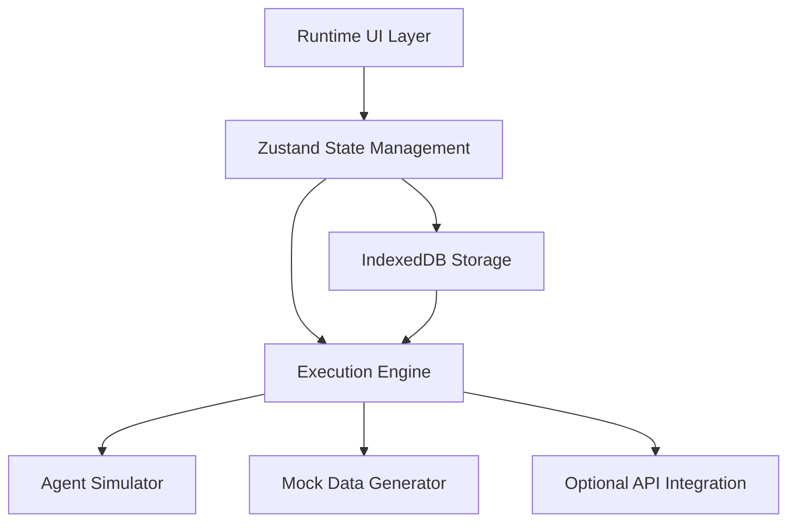

# Agent Factory Runtime Environment - Technical Design Specification
*Version 1.0 | Kiro SDD Format*

## Architecture Overview

The Agent Factory Runtime Environment extends the existing Runtime module with three core subsystems: Agent Runtime Environment, Agent Team Testing, and Mock Data Generation. The architecture follows a client-side-first approach with optional API integration for enhanced capabilities.



### Core Design Principles

1. **Client-Side First**: Minimize backend dependencies while supporting optional API enhancement
2. **Progressive Enhancement**: Start with mock execution, upgrade to real API integration
3. **State Isolation**: Each runtime session operates independently
4. **Real-Time Feedback**: Stream all execution events to UI immediately
5. **Type Safety**: Strict TypeScript with no `any` types
6. **Component Modularity**: Keep components under 300 lines

## Technical Architecture

### 1. Frontend Architecture

#### Component Tree Structure
```
src/features/runtime/
├── index.tsx                     # Updated Runtime module entry
├── components/
│   ├── agent-runtime/
│   │   ├── AgentCatalog.tsx     # Agent browsing and selection
│   │   ├── AgentConfig.tsx      # Runtime configuration
│   │   ├── ChatInterface.tsx    # Interactive agent chat
│   │   ├── ExecutionMonitor.tsx # Performance monitoring
│   │   └── SessionHistory.tsx   # History and replay
│   ├── team-testing/
│   │   ├── TeamComposer.tsx     # Team building interface
│   │   ├── WorkflowDesigner.tsx # Scenario definition
│   │   ├── OrchestrationRules.tsx # Rules configuration
│   │   ├── TeamExecution.tsx    # Workflow execution
│   │   └── HandoffTimeline.tsx  # Visualization
│   ├── mock-data/
│   │   ├── DomainSelector.tsx   # Domain/schema selection
│   │   ├── GenerationConfig.tsx # Parameter configuration
│   │   ├── DataGenerator.tsx    # Generation engine UI
│   │   ├── DataPreview.tsx      # Preview and validation
│   │   └── DataExport.tsx       # Export management
│   └── shared/
│       ├── ExecutionStream.tsx  # Real-time execution display
│       ├── TimelineViz.tsx      # Timeline visualization
│       ├── TokenMeter.tsx       # Token usage widget
│       └── ErrorBoundary.tsx    # Error handling
├── stores/
│   ├── agentRuntimeStore.ts     # Agent execution state
│   ├── teamTestingStore.ts      # Team workflow state
│   ├── mockDataStore.ts         # Data generation state
│   └── executionStore.ts        # Shared execution state
├── services/
│   ├── agentExecutor.ts         # Agent execution engine
│   ├── mockDataGenerator.ts     # Data generation engine
│   ├── workflowOrchestrator.ts  # Team workflow engine
│   └── constraintSolver.ts      # FK constraint handling
└── types/
    ├── runtime.types.ts         # Existing runtime types
    ├── agentExecution.types.ts  # Agent execution types
    ├── teamWorkflow.types.ts    # Team workflow types
    └── mockData.types.ts        # Data generation types
```

#### State Management Architecture

##### Zustand Store Structure
```typescript
// Core execution state shared across features
interface ExecutionStore {
  sessions: Map<string, ExecutionSession>;
  activeSession: string | null;
  
  createSession: (config: SessionConfig) => string;
  closeSession: (sessionId: string) => void;
  switchSession: (sessionId: string) => void;
  
  // Real-time event streaming
  streamEvents: Subject<ExecutionEvent>;
  subscribeToEvents: (sessionId: string, callback: (event: ExecutionEvent) => void) => void;
}

// Agent runtime specific state
interface AgentRuntimeStore {
  selectedAgent: AgentDefinition | null;
  configuration: RuntimeConfiguration;
  executionHistory: ExecutionRecord[];
  
  configureAgent: (agentId: string, config: RuntimeConfiguration) => void;
  executeCommand: (sessionId: string, command: string) => Promise<void>;
  getExecutionMetrics: (sessionId: string) => ExecutionMetrics;
}

// Team testing specific state  
interface TeamTestingStore {
  currentTeam: AgentTeam | null;
  workflow: WorkflowDefinition | null;
  executionState: TeamExecutionState;
  
  composeTeam: (agents: AgentDefinition[]) => void;
  defineWorkflow: (scenario: WorkflowScenario) => void;
  executeWorkflow: (teamId: string) => Promise<void>;
}

// Mock data generation state
interface MockDataStore {
  selectedDomain: Domain;
  generationConfig: DataGenerationConfig;
  generatedData: Map<string, TableData[]>;
  
  selectDomain: (domain: Domain) => void;
  configureGeneration: (config: DataGenerationConfig) => void;
  generateData: () => Promise<void>;
  exportData: (format: ExportFormat) => void;
}
```

### 2. Data Models

#### Core Types

```typescript
// Agent execution session
interface ExecutionSession {
  id: string;
  agentId: string;
  configuration: RuntimeConfiguration;
  status: 'running' | 'paused' | 'stopped' | 'error';
  createdAt: Date;
  lastActivity: Date;
  
  // Execution context
  context: AgentContext;
  messages: ChatMessage[];
  events: ExecutionEvent[];
  
  // Resource tracking
  metrics: ExecutionMetrics;
  tokenUsage: TokenUsage;
}

// Runtime configuration for agents
interface RuntimeConfiguration {
  domain: Domain;
  accessibleTables: string[];
  parameters: Record<string, any>;
  resourceLimits: {
    tokenBudget: number;
    timeoutMs: number;
    maxIterations: number;
  };
  environment: 'mock' | 'sandbox' | 'api';
}

// Agent context with domain data access
interface AgentContext {
  domain: Domain;
  tables: Map<string, TableSchema>;
  data: Map<string, any[]>;  // Mock data for tables
  constraints: ForeignKeyConstraint[];
}

// Execution event for real-time streaming
interface ExecutionEvent {
  id: string;
  sessionId: string;
  timestamp: Date;
  type: 'command' | 'response' | 'tool_call' | 'tool_result' | 'error' | 'thinking';
  data: any;
  metadata?: {
    tokenCount?: number;
    executionTime?: number;
    tablesAccessed?: string[];
  };
}

// Team workflow definition
interface WorkflowDefinition {
  id: string;
  name: string;
  scenario: WorkflowScenario;
  agents: AgentRole[];
  orchestrationRules: OrchestrationRule[];
  qualityGates: QualityGate[];
  expectedOutcomes: OutcomeSpecification[];
}

// Agent role in team workflow
interface AgentRole {
  agentId: string;
  role: 'initiator' | 'processor' | 'validator' | 'finalizer';
  dependencies: string[];  // Agent IDs this role depends on
  configuration: RuntimeConfiguration;
}

// Orchestration rule for agent coordination
interface OrchestrationRule {
  id: string;
  condition: RuleCondition;
  action: RuleAction;
  priority: number;
  retryPolicy?: RetryPolicy;
}

// Mock data generation configuration
interface DataGenerationConfig {
  domain: Domain;
  tables: TableGenerationConfig[];
  globalSettings: {
    seed?: number;
    dateRange: [Date, Date];
    locale: string;
  };
}

// Table-specific generation configuration
interface TableGenerationConfig {
  tableName: string;
  rowCount: number;
  statusDistribution?: Record<string, number>;  // e.g., {"ACTIVE": 0.7, "PENDING": 0.3}
  customGenerators?: Record<string, DataGenerator>;
  constraints: GenerationConstraint[];
}

// Foreign key constraint for generation
interface ForeignKeyConstraint {
  sourceTable: string;
  sourceColumn: string;
  targetTable: string;
  targetColumn: string;
  nullable: boolean;
}
```

#### Domain-Specific Models

```typescript
// OBR domain integration
interface Domain {
  id: 'wms' | 'fms' | 'oms' | 'bnp' | 'yms';
  name: string;
  schema: DomainSchema;
  workflows: WorkflowTemplate[];
  agents: AgentDefinition[];
}

// Domain schema with table definitions
interface DomainSchema {
  tables: Map<string, TableSchema>;
  relationships: ForeignKeyConstraint[];
  views: ViewDefinition[];
  constraints: BusinessConstraint[];
}

// Table schema for mock data generation
interface TableSchema {
  name: string;
  columns: ColumnDefinition[];
  primaryKey: string[];
  indexes: IndexDefinition[];
  constraints: TableConstraint[];
}

// Column definition with generation hints
interface ColumnDefinition {
  name: string;
  type: 'string' | 'number' | 'boolean' | 'date' | 'uuid' | 'json';
  nullable: boolean;
  unique: boolean;
  defaultValue?: any;
  
  // Data generation hints
  generationHints?: {
    faker?: string;  // Faker.js method
    pattern?: string;  // Regex pattern
    enum?: string[];  // Fixed value set
    range?: [number, number];  // Numeric range
  };
}
```

### 3. Execution Engine Design

#### Agent Execution Engine

The agent execution engine supports three execution modes:

1. **Mock Mode**: Simulates agent behavior using predefined response templates
2. **Sandbox Mode**: Executes simplified agent logic client-side
3. **API Mode**: Integrates with real LLM APIs for actual agent execution

```typescript
interface AgentExecutor {
  mode: 'mock' | 'sandbox' | 'api';
  
  executeCommand(
    sessionId: string, 
    command: string, 
    context: AgentContext
  ): AsyncIterable<ExecutionEvent>;
  
  pauseExecution(sessionId: string): void;
  resumeExecution(sessionId: string): void;
  stopExecution(sessionId: string): void;
}

// Mock execution implementation
class MockAgentExecutor implements AgentExecutor {
  async *executeCommand(sessionId: string, command: string, context: AgentContext) {
    // Simulate thinking phase
    yield {
      type: 'thinking',
      data: { message: 'Analyzing command and available data...' },
      timestamp: new Date(),
    };
    
    await delay(500);
    
    // Simulate tool calls based on command analysis
    const toolCalls = this.simulateToolCalls(command, context);
    for (const call of toolCalls) {
      yield { type: 'tool_call', data: call, timestamp: new Date() };
      await delay(200);
      
      const result = this.simulateToolResult(call, context);
      yield { type: 'tool_result', data: result, timestamp: new Date() };
      await delay(300);
    }
    
    // Generate response using template matching
    const response = this.generateResponse(command, toolCalls, context);
    yield { type: 'response', data: response, timestamp: new Date() };
  }
}
```

#### Workflow Orchestration Engine

```typescript
class WorkflowOrchestrator {
  async executeWorkflow(
    workflow: WorkflowDefinition,
    team: AgentTeam
  ): AsyncIterable<TeamExecutionEvent> {
    
    const executionGraph = this.buildExecutionGraph(workflow);
    const agentSessions = new Map<string, ExecutionSession>();
    
    // Initialize all agent sessions
    for (const role of workflow.agents) {
      const session = await this.createAgentSession(role);
      agentSessions.set(role.agentId, session);
      
      yield {
        type: 'agent_initialized',
        agentId: role.agentId,
        timestamp: new Date(),
      };
    }
    
    // Execute workflow steps according to orchestration rules
    for (const step of executionGraph.getExecutionOrder()) {
      yield* this.executeWorkflowStep(step, agentSessions, workflow);
      
      // Check quality gates
      const gateResults = await this.evaluateQualityGates(step, workflow);
      if (!gateResults.passed) {
        yield {
          type: 'quality_gate_failed',
          step: step.id,
          failures: gateResults.failures,
          timestamp: new Date(),
        };
        
        if (gateResults.blocking) {
          throw new WorkflowExecutionError('Blocking quality gate failed');
        }
      }
    }
  }
}
```

#### Mock Data Generation Engine

```typescript
class MockDataGenerator {
  constructor(
    private constraintSolver: ConstraintSolver,
    private dataGeneratorFactory: DataGeneratorFactory
  ) {}
  
  async generateData(
    config: DataGenerationConfig
  ): Promise<Map<string, TableData[]>> {
    
    // Resolve table dependencies using topological sort
    const sortedTables = this.constraintSolver.topologicalSort(
      config.domain.schema.tables,
      config.domain.schema.relationships
    );
    
    const generatedData = new Map<string, TableData[]>();
    
    // Generate data for each table in dependency order
    for (const table of sortedTables) {
      const tableConfig = config.tables.find(t => t.tableName === table.name);
      if (!tableConfig) continue;
      
      const generator = this.dataGeneratorFactory.createGenerator(table, tableConfig);
      const data = await generator.generateRows(
        tableConfig.rowCount,
        generatedData  // Previously generated data for FK resolution
      );
      
      generatedData.set(table.name, data);
      
      // Validate constraints
      const violations = this.constraintSolver.validateConstraints(
        table,
        data,
        generatedData
      );
      
      if (violations.length > 0) {
        throw new ConstraintViolationError(violations);
      }
    }
    
    return generatedData;
  }
}
```

### 4. Real-Time Communication

#### Event Streaming Architecture

```typescript
// Event streaming using RxJS Observables
interface EventStream {
  subscribe(sessionId: string): Observable<ExecutionEvent>;
  emit(sessionId: string, event: ExecutionEvent): void;
  close(sessionId: string): void;
}

// WebSocket integration for real-time updates (optional)
class WebSocketEventStream implements EventStream {
  private connections = new Map<string, WebSocket>();
  
  subscribe(sessionId: string): Observable<ExecutionEvent> {
    return new Observable(subscriber => {
      const ws = new WebSocket(`ws://localhost:3000/runtime/${sessionId}`);
      this.connections.set(sessionId, ws);
      
      ws.onmessage = (event) => {
        const executionEvent = JSON.parse(event.data);
        subscriber.next(executionEvent);
      };
      
      ws.onerror = (error) => subscriber.error(error);
      ws.onclose = () => subscriber.complete();
      
      return () => {
        ws.close();
        this.connections.delete(sessionId);
      };
    });
  }
}

// In-memory event stream for client-side execution
class InMemoryEventStream implements EventStream {
  private subjects = new Map<string, Subject<ExecutionEvent>>();
  
  subscribe(sessionId: string): Observable<ExecutionEvent> {
    if (!this.subjects.has(sessionId)) {
      this.subjects.set(sessionId, new Subject<ExecutionEvent>());
    }
    return this.subjects.get(sessionId)!.asObservable();
  }
  
  emit(sessionId: string, event: ExecutionEvent): void {
    const subject = this.subjects.get(sessionId);
    if (subject) {
      subject.next(event);
    }
  }
}
```

### 5. UI Component Design

#### Chat Interface Component

```typescript
interface ChatInterfaceProps {
  sessionId: string;
  agent: AgentDefinition;
  configuration: RuntimeConfiguration;
}

export function ChatInterface({ sessionId, agent, configuration }: ChatInterfaceProps) {
  const [messages, setMessages] = useState<ChatMessage[]>([]);
  const [currentInput, setCurrentInput] = useState('');
  const [isExecuting, setIsExecuting] = useState(false);
  
  const { executeCommand } = useAgentRuntime();
  const { subscribeToEvents } = useExecutionStore();
  
  useEffect(() => {
    const subscription = subscribeToEvents(sessionId, (event) => {
      setMessages(prev => [...prev, eventToChatMessage(event)]);
      
      if (event.type === 'response') {
        setIsExecuting(false);
      }
    });
    
    return () => subscription.unsubscribe();
  }, [sessionId]);
  
  const handleSendMessage = async () => {
    if (!currentInput.trim() || isExecuting) return;
    
    const userMessage: ChatMessage = {
      id: generateId(),
      type: 'user',
      content: currentInput,
      timestamp: new Date(),
    };
    
    setMessages(prev => [...prev, userMessage]);
    setCurrentInput('');
    setIsExecuting(true);
    
    try {
      await executeCommand(sessionId, currentInput);
    } catch (error) {
      setIsExecuting(false);
      setMessages(prev => [...prev, {
        id: generateId(),
        type: 'error',
        content: error.message,
        timestamp: new Date(),
      }]);
    }
  };
  
  return (
    <div className="flex flex-col h-full">
      <div className="flex-1 overflow-y-auto p-4 space-y-4">
        {messages.map(message => (
          <MessageBubble key={message.id} message={message} />
        ))}
        {isExecuting && <TypingIndicator />}
      </div>
      
      <div className="border-t p-4">
        <div className="flex space-x-2">
          <Input
            value={currentInput}
            onChange={(e) => setCurrentInput(e.target.value)}
            onKeyPress={(e) => e.key === 'Enter' && handleSendMessage()}
            placeholder={`Send command to ${agent.name}...`}
            disabled={isExecuting}
          />
          <Button onClick={handleSendMessage} disabled={isExecuting}>
            Send
          </Button>
        </div>
      </div>
    </div>
  );
}
```

#### Timeline Visualization Component

```typescript
interface TimelineVizProps {
  events: ExecutionEvent[];
  height?: number;
  onEventClick?: (event: ExecutionEvent) => void;
}

export function TimelineViz({ events, height = 400, onEventClick }: TimelineVizProps) {
  const canvasRef = useRef<HTMLCanvasElement>(null);
  const [viewWindow, setViewWindow] = useState({ start: 0, end: 100 });
  
  useEffect(() => {
    if (!canvasRef.current) return;
    
    const canvas = canvasRef.current;
    const ctx = canvas.getContext('2d')!;
    const dpr = window.devicePixelRatio || 1;
    
    // Set canvas size
    canvas.width = canvas.offsetWidth * dpr;
    canvas.height = height * dpr;
    ctx.scale(dpr, dpr);
    
    // Clear canvas
    ctx.clearRect(0, 0, canvas.offsetWidth, height);
    
    // Draw timeline
    const timeRange = events.length > 0 ? {
      start: Math.min(...events.map(e => e.timestamp.getTime())),
      end: Math.max(...events.map(e => e.timestamp.getTime())),
    } : { start: Date.now(), end: Date.now() + 1000 };
    
    const timeScale = canvas.offsetWidth / (timeRange.end - timeRange.start);
    
    // Draw events
    events.forEach((event, index) => {
      const x = (event.timestamp.getTime() - timeRange.start) * timeScale;
      const y = height / 2;
      
      // Event icon
      const color = getEventColor(event.type);
      ctx.fillStyle = color;
      ctx.beginPath();
      ctx.arc(x, y, 4, 0, 2 * Math.PI);
      ctx.fill();
      
      // Event label
      ctx.fillStyle = '#374151';
      ctx.font = '12px sans-serif';
      ctx.textAlign = 'center';
      ctx.fillText(event.type, x, y - 15);
    });
    
    // Draw timeline axis
    ctx.strokeStyle = '#D1D5DB';
    ctx.lineWidth = 1;
    ctx.beginPath();
    ctx.moveTo(0, height / 2);
    ctx.lineTo(canvas.offsetWidth, height / 2);
    ctx.stroke();
    
  }, [events, height, viewWindow]);
  
  const handleCanvasClick = (e: React.MouseEvent<HTMLCanvasElement>) => {
    if (!canvasRef.current || !onEventClick) return;
    
    const rect = canvasRef.current.getBoundingClientRect();
    const x = e.clientX - rect.left;
    
    // Find closest event
    const timeRange = events.length > 0 ? {
      start: Math.min(...events.map(e => e.timestamp.getTime())),
      end: Math.max(...events.map(e => e.timestamp.getTime())),
    } : { start: Date.now(), end: Date.now() + 1000 };
    
    const timeScale = rect.width / (timeRange.end - timeRange.start);
    const clickTime = timeRange.start + (x / timeScale);
    
    const closestEvent = events.reduce((closest, event) => {
      const eventTime = event.timestamp.getTime();
      const closestTime = closest.timestamp.getTime();
      
      return Math.abs(eventTime - clickTime) < Math.abs(closestTime - clickTime) 
        ? event : closest;
    }, events[0]);
    
    if (closestEvent && Math.abs(closestEvent.timestamp.getTime() - clickTime) < 5000) {
      onEventClick(closestEvent);
    }
  };
  
  return (
    <div className="relative">
      <canvas
        ref={canvasRef}
        className="w-full cursor-pointer"
        style={{ height }}
        onClick={handleCanvasClick}
      />
    </div>
  );
}
```

### 6. Storage Architecture

#### IndexedDB Schema

```typescript
// Dexie database schema for client-side persistence
export class RuntimeDatabase extends Dexie {
  executionSessions!: Table<ExecutionSession>;
  teamWorkflows!: Table<WorkflowDefinition>;
  mockDataConfigs!: Table<DataGenerationConfig>;
  generatedDataSets!: Table<GeneratedDataSet>;
  
  constructor() {
    super('RuntimeDatabase');
    
    this.version(1).stores({
      executionSessions: '&id, agentId, status, createdAt, lastActivity',
      teamWorkflows: '&id, name, domain, createdAt',
      mockDataConfigs: '&id, domain, createdAt',
      generatedDataSets: '&id, configId, domain, createdAt',
    });
  }
}

// Generated data set for persistence
interface GeneratedDataSet {
  id: string;
  configId: string;
  domain: Domain;
  data: Map<string, TableData[]>;
  metadata: {
    rowCounts: Record<string, number>;
    generationTime: number;
    checksum: string;
  };
  createdAt: Date;
}
```

### 7. API Integration Architecture

#### Optional Backend Integration

```typescript
// API client for enhanced capabilities
interface RuntimeAPIClient {
  executeAgent(
    agentId: string, 
    command: string, 
    context: AgentContext
  ): Promise<AsyncIterable<ExecutionEvent>>;
  
  validateWorkflow(workflow: WorkflowDefinition): Promise<ValidationResult>;
  generateLargeDataset(config: DataGenerationConfig): Promise<string>; // Returns job ID
  
  // WebSocket connection for real-time updates
  connectToSession(sessionId: string): Promise<WebSocket>;
}

// Configuration for API integration
interface APIConfiguration {
  enabled: boolean;
  baseUrl: string;
  apiKey?: string;
  features: {
    realExecution: boolean;
    largeDataGeneration: boolean;
    collaborativeWorkflows: boolean;
  };
}
```

## Performance Considerations

### Client-Side Optimization
- **Virtualization**: Use react-window for large lists (agent catalog, execution history)
- **Lazy Loading**: Load agent definitions and schemas on demand
- **Debouncing**: Debounce search and configuration inputs
- **Caching**: Cache generated data and execution results in IndexedDB
- **Worker Threads**: Use Web Workers for data generation and complex computations

### Memory Management
- **Event Stream Limits**: Limit event history to prevent memory leaks
- **Data Cleanup**: Automatically clean up old sessions and generated data
- **Lazy Evaluation**: Load execution history and large datasets on demand
- **Garbage Collection**: Properly dispose of observables and event listeners

### Rendering Optimization
- **React.memo**: Memoize expensive components
- **useMemo/useCallback**: Cache expensive computations and functions
- **Code Splitting**: Split components by feature for better loading
- **Bundle Analysis**: Monitor bundle size and optimize imports

## Security Considerations

### Client-Side Security
- **Input Validation**: Validate all user inputs before processing
- **XSS Prevention**: Sanitize all displayed content, especially generated data
- **CSP Headers**: Implement Content Security Policy for additional protection
- **Secure Storage**: Use secure storage for sensitive configuration data

### Execution Sandboxing
- **Code Isolation**: Isolate agent execution from main application
- **Resource Limits**: Enforce memory and CPU limits for agent execution
- **Network Restrictions**: Prevent unauthorized external API calls
- **Data Access Control**: Limit agent access to configured tables only

## Accessibility & Internationalization

### Accessibility (WCAG 2.1 AA)
- **Keyboard Navigation**: Full keyboard support for all interactions
- **Screen Reader Support**: Proper ARIA labels and landmarks
- **High Contrast**: Support high contrast modes
- **Focus Management**: Clear focus indicators and logical tab order

### Internationalization
- **Chinese UI**: Primary UI in Chinese with English technical terms
- **Localization**: Support for date/time and number formatting
- **RTL Support**: Preparation for right-to-left languages
- **Cultural Adaptation**: Appropriate icons and interaction patterns

## Testing Strategy

### Component Testing
- **Unit Tests**: Jest + React Testing Library for all components
- **Integration Tests**: Test component interactions and state management
- **Visual Regression**: Screenshot testing for UI consistency
- **Accessibility Testing**: Automated a11y testing with axe-core

### Execution Engine Testing
- **Mock Execution**: Test all execution modes with various scenarios
- **Constraint Validation**: Test FK constraint handling and data generation
- **Error Handling**: Test error scenarios and recovery mechanisms
- **Performance Testing**: Load testing with large datasets and workflows

### End-to-End Testing
- **User Workflows**: Test complete user journeys through features
- **Browser Compatibility**: Test across Chrome, Firefox, Safari, Edge
- **Responsive Design**: Test on various screen sizes and devices
- **Data Persistence**: Test IndexedDB operations and data recovery