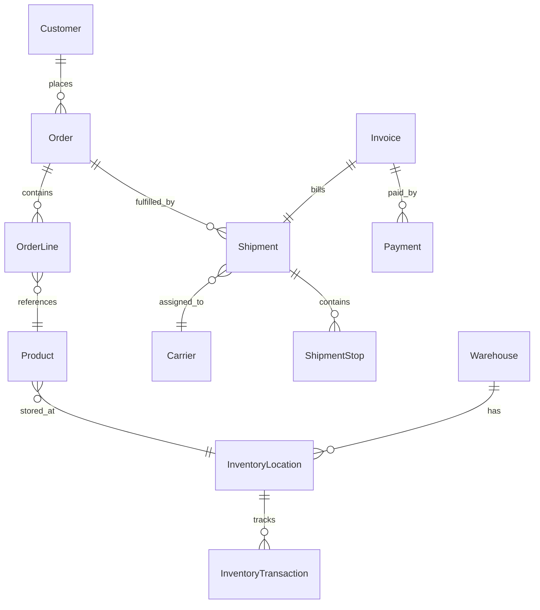

# Agent Factory Runtime Environment - Domain Analysis
*Version 1.0 | Kiro SDD Format*

## Domain Context Analysis

The Agent Factory Runtime Environment operates within the logistics industry, specifically targeting the five core domains of modern logistics operations: Warehouse Management (WMS), Fleet Management (FMS), Order Management (OMS), Billing & Payment (BNP), and Yard Management (YMS). This analysis examines the domain-specific requirements, interaction patterns, and data flow characteristics that shape the runtime environment design.

## Logistics Domain Breakdown

### 1. Warehouse Management System (WMS) Domain

#### Characteristics
- **High Transaction Volume**: Thousands of inventory movements per day
- **Real-time Requirements**: Sub-second response times for inventory queries
- **Complex Workflows**: Multi-step processes with quality gates (入库链, 出库链, 盘点链)
- **State Dependencies**: Operations must follow strict sequence (receive → putaway → pick → pack → ship)
- **Error Sensitivity**: Inventory discrepancies have cascading effects

#### Key Agent Patterns
```
WMS Orchestrator
├── Inbound Chain (入库链)
│   ├── Receipt Clerk → Dock Coordinator → Receiving Operator → Putaway Operator
│   └── Optional: QC Inspector
├── Outbound Chain (出库链)  
│   ├── Order Processor → Wave Planner → Pick Operator → Pack Operator → Shipping Clerk
│   └── Optional: Parcel Station Operator
├── Cycle Count Chain (盘点链)
│   └── Inventory Controller → QC Inspector → Analytics Specialist
└── Replenishment Chain (补货链)
    └── Inventory Controller → Putaway Operator
```

#### Data Flow Patterns
- **Hierarchical Data**: Location → Zone → Aisle → Shelf → Position
- **Temporal Sequences**: Timestamp-ordered inventory movements
- **Status Propagation**: Order status flows through fulfillment pipeline
- **Constraint Networks**: Capacity limits, weight restrictions, compatibility rules

#### Testing Scenarios
1. **Peak Season Simulation**: 10x normal order volume with resource constraints
2. **Inventory Shortage Handling**: Stockout scenarios with substitution logic
3. **Quality Failure Recovery**: Failed QC with return-to-vendor workflow
4. **System Integration**: Cross-dock operations with minimal inventory
5. **Exception Handling**: Damaged goods, mispicks, system downtime

### 2. Fleet Management System (FMS) Domain

#### Characteristics
- **Geographic Complexity**: Route optimization across regions
- **Dynamic Constraints**: Traffic, weather, driver hours-of-service
- **Multi-modal Operations**: Truck, rail, air, ocean freight coordination
- **Cost Optimization**: Fuel, time, driver efficiency balance
- **Regulatory Compliance**: DOT regulations, customs, hazmat

#### Key Agent Patterns
```
FMS Orchestrator
├── Transport Planning Chain
│   ├── Route Optimizer → Load Planner → Carrier Selector
│   └── Dispatch Coordinator
├── Dispatch Chain (派车链)
│   ├── Dispatcher → Driver Coordinator → Vehicle Tracker
│   └── Customer Notification Agent
└── Rating Chain (计费链)
    ├── Rate Calculator → Fuel Surcharge Agent → Accessorial Handler
    └── Invoice Preparation Agent
```

#### Data Flow Patterns
- **Geospatial Data**: GPS coordinates, route polylines, traffic data
- **Time-series Events**: Vehicle telemetry, driver status updates
- **Hierarchical Planning**: Strategic → Tactical → Operational planning levels
- **Event-driven Updates**: Real-time tracking, delivery confirmations

#### Testing Scenarios
1. **Multi-stop Route Optimization**: 20+ stops with time windows
2. **Carrier Capacity Crisis**: Limited available capacity during peak season
3. **Weather Disruption**: Hurricane causing route re-planning
4. **Cross-border Operations**: Canada/Mexico with customs delays
5. **Equipment Failure**: Vehicle breakdown requiring re-dispatch

### 3. Order Management System (OMS) Domain

#### Characteristics
- **Customer-centric**: Order lifecycle from quote to delivery
- **Multi-channel Integration**: Web, mobile, phone, EDI orders
- **Inventory Synchronization**: Real-time availability across channels
- **Fulfillment Coordination**: Orchestrate WMS, FMS, and customer communication
- **Exception Management**: Backorders, cancellations, returns

#### Key Agent Patterns
```
OMS Orchestrator
├── Order Processing Chain
│   ├── Order Validator → Inventory Checker → Credit Verifier
│   ├── Tax Calculator → Order Confirmor
│   └── Customer Notification Agent
├── Fulfillment Chain (履约链)
│   ├── Fulfillment Tracker → WMS Interface → FMS Interface
│   └── Delivery Notification Agent
└── Inventory Sync Chain
    ├── Inventory Aggregator → Channel Updater → Availability Publisher
    └── Backorder Manager
```

#### Data Flow Patterns
- **Customer Journey**: Quote → Order → Fulfillment → Delivery → Invoice
- **Multi-system Coordination**: Synchronization points between systems
- **Event Sourcing**: Order events create immutable audit trail
- **State Machine**: Order status transitions with business rules

#### Testing Scenarios
1. **Omnichannel Order**: Single order fulfilled from multiple warehouses
2. **Partial Fulfillment**: Backorder handling with customer choice
3. **Order Modification**: Changes after fulfillment has started
4. **Bulk Order Processing**: Enterprise customer with 1000+ line items
5. **Return Processing**: Damaged goods return with credit/exchange

### 4. Billing & Payment (BNP) Domain

#### Characteristics
- **Financial Accuracy**: Zero-tolerance for billing errors
- **Regulatory Compliance**: SOX, taxation, audit requirements
- **Multi-currency Operations**: Global operations with currency conversion
- **Complex Pricing**: Matrix rates, fuel surcharges, accessorial charges
- **Integration Points**: ERP, accounting, banking systems

#### Key Agent Patterns
```
BNP Orchestrator
├── Billing-to-Invoice Chain
│   ├── Rate Calculator → Fee Calculator → Tax Calculator
│   ├── Invoice Generator → Invoice Reviewer → Invoice Sender
│   └── GL Accountant
├── Payment-to-Reconciliation Chain
│   ├── Payment Collector → Bank Reconciler → GL Accountant
│   └── Cash Application Agent
└── Collection Chain (催收链)
    ├── Credit Warning Agent → Collection Agent → Debt Collection Agent
    └── Legal Escalation Agent
```

#### Data Flow Patterns
- **Financial Workflows**: Accounting double-entry requirements
- **Approval Hierarchies**: Dollar thresholds for automatic vs manual approval
- **Audit Trails**: Complete transaction history for compliance
- **Reconciliation Loops**: Bank statements vs internal records

#### Testing Scenarios
1. **Complex Rate Calculation**: Multi-leg shipment with various charges
2. **Currency Conversion**: International shipment with rate fluctuation
3. **Dispute Resolution**: Customer dispute with credit memo processing
4. **Large Customer Payment**: ACH payment with complex cash application
5. **Vendor Bill Processing**: 3-way match with purchase orders

### 5. Yard Management System (YMS) Domain

#### Characteristics
- **Physical Space Management**: Dock doors, yard spots, equipment
- **Appointment Coordination**: Carrier scheduling with time slots
- **Resource Optimization**: Driver wait times, equipment utilization
- **Safety Compliance**: OSHA requirements, security protocols
- **Integration Hub**: Interface between carriers and warehouse

#### Key Agent Patterns
```
YMS Orchestrator
├── Appointment Chain (预约链)
│   ├── Appointment Scheduler → Resource Checker → Appointment Approver
│   └── Carrier Notification Agent
└── Check-in Chain (进门链)
    ├── Gate Check-in Operator → Dock Assignment Agent
    ├── Equipment Inspector → Check-out Operator
    └── Carrier Portal Liaison
```

#### Data Flow Patterns
- **Spatial Scheduling**: 2D/3D space allocation algorithms
- **Time-slot Management**: Appointment calendars with capacity limits
- **Equipment Tracking**: Trailers, containers, yard equipment location
- **Security Events**: Access control, surveillance integration

#### Testing Scenarios
1. **Peak Hour Scheduling**: 50+ appointments in 2-hour window
2. **Equipment Shortage**: Limited dock doors during high demand
3. **Emergency Access**: After-hours delivery requiring security override
4. **Long-haul Carrier**: Overnight parking with driver rest requirements
5. **Compliance Inspection**: DOT inspection causing delays

## Cross-Domain Interaction Patterns

### 1. Hierarchical Orchestration Pattern

The enterprise architecture follows a three-tier hierarchical structure that enables both top-down coordination and bottom-up escalation:

```
Enterprise Orchestrator
├── Domain Orchestrators (WMS, FMS, OMS, BNP, YMS)
│   ├── Process Chain Coordinators (入库链, 出库链, etc.)
│   │   ├── Specialized Agents (Receipt Clerk, Dispatcher, etc.)
│   │   └── Quality Gates & Validation Agents
│   └── Cross-chain Integration Agents
└── Enterprise-wide Services (Analytics, Compliance, Security)
```

#### Coordination Mechanisms
- **Top-down Planning**: Enterprise goals cascade to domain priorities
- **Bottom-up Escalation**: Domain issues escalate through hierarchy
- **Lateral Coordination**: Same-level agents coordinate directly when authorized
- **Emergency Bypass**: Critical issues can skip hierarchy levels

#### Implementation in Runtime Environment
```typescript
interface HierarchicalCoordination {
  level: 'enterprise' | 'domain' | 'process' | 'agent';
  parentCoordinator?: string;
  childAgents: string[];
  escalationRules: EscalationRule[];
  coordinationProtocols: CoordinationProtocol[];
}

interface EscalationRule {
  condition: RuleCondition;
  targetLevel: number;  // How many levels up to escalate
  timeout: number;      // Auto-escalate after timeout
  severity: 'info' | 'warning' | 'error' | 'critical';
}
```

### 2. Event-Driven Cross-Domain Communication

Domains communicate through event streaming rather than direct API calls, enabling loose coupling and high scalability:

```
Event Bus
├── Order Events: OrderCreated → OrderAllocated → OrderPicked → OrderShipped
├── Inventory Events: StockReceived → StockAllocated → StockPicked → StockShipped
├── Payment Events: InvoiceGenerated → PaymentReceived → PaymentApplied
└── Exception Events: StockOut → DeliveryDelay → QualityFailure
```

#### Event Flow Patterns

1. **Order-to-Cash Flow**
```
OMS: OrderCreated
 ↓
WMS: InventoryAllocated → PickCompleted → ShipmentCreated
 ↓
FMS: LoadPlanned → DispatchConfirmed → DeliveryCompleted  
 ↓
BNP: InvoiceGenerated → PaymentProcessed
```

2. **Inbound-to-Available Flow**
```
YMS: AppointmentConfirmed → CheckInCompleted
 ↓
WMS: ReceiptStarted → QualityPassed → PutawayCompleted
 ↓
OMS: InventoryAvailable → OrderAllocated
```

#### Implementation in Runtime Environment
```typescript
interface DomainEvent {
  eventId: string;
  domainSource: Domain;
  eventType: string;
  timestamp: Date;
  data: any;
  correlationId?: string;  // Link related events
  causationId?: string;    // Event that caused this event
}

interface EventSubscription {
  domain: Domain;
  eventTypes: string[];
  handler: (event: DomainEvent) => Promise<void>;
  retryPolicy: RetryPolicy;
}
```

### 3. Data Consistency Patterns

#### Eventual Consistency Model
- **Local Consistency**: Each domain maintains immediate consistency within its boundaries
- **Cross-domain Consistency**: Achieved through event sourcing and saga patterns
- **Compensating Actions**: Failed cross-domain transactions trigger compensating workflows

#### Data Synchronization Points
1. **Inventory Levels**: OMS ↔ WMS real-time synchronization
2. **Order Status**: OMS → Customer notifications within 30 seconds
3. **Financial Data**: BNP month-end reconciliation with 99.9% accuracy
4. **Location Updates**: FMS GPS updates every 5 minutes

#### Implementation in Runtime Environment
```typescript
interface SagaStep {
  domain: Domain;
  action: SagaAction;
  compensatingAction?: SagaAction;
  timeout: number;
  retryPolicy: RetryPolicy;
}

interface SagaDefinition {
  id: string;
  name: string;
  steps: SagaStep[];
  isolationLevel: 'read_uncommitted' | 'read_committed' | 'serializable';
}
```

## Data Flow Architecture

### 1. Core Data Entities and Relationships

#### Entity Relationship Overview


#### Domain-Specific Data Models

**WMS Core Entities**
```typescript
interface WarehouseLocation {
  locationId: string;
  warehouseId: string;
  zone: string;
  aisle: string;
  shelf: string;
  position: string;
  capacity: VolumeWeight;
  restrictions: LocationRestriction[];
}

interface InventoryTransaction {
  transactionId: string;
  productId: string;
  locationId: string;
  transactionType: 'receive' | 'pick' | 'move' | 'adjust' | 'cycle_count';
  quantity: number;
  timestamp: Date;
  reasonCode?: string;
  operatorId: string;
}
```

**FMS Core Entities**
```typescript
interface LoadPlan {
  loadId: string;
  carrierId: string;
  vehicleId: string;
  driverId: string;
  route: RouteStop[];
  totalDistance: number;
  estimatedDuration: number;
  constraints: RouteConstraint[];
}

interface RouteStop {
  stopId: string;
  sequence: number;
  location: GeoLocation;
  appointmentWindow: TimeWindow;
  serviceTime: number;
  shipments: string[];  // Shipment IDs
}
```

### 2. Data Flow Patterns by Scenario

#### Scenario 1: Complete Order Fulfillment

```
1. Order Creation (OMS)
   Data: Customer, OrderLines, DeliveryAddress, RequestedDate
   
2. Inventory Allocation (WMS)
   Input: OrderLines, WarehouseCapability
   Process: ATP check, Location assignment, Wave planning
   Output: AllocationConfirmation, PickTasks
   
3. Pick Execution (WMS)  
   Input: PickTasks, InventoryLocations
   Process: Pick path optimization, Quality verification
   Output: PickConfirmation, PackingTasks
   
4. Load Planning (FMS)
   Input: PackingConfirmation, DeliveryAddress, ServiceRequirements
   Process: Route optimization, Carrier selection
   Output: LoadPlan, DispatchInstructions
   
5. Billing Generation (BNP)
   Input: LoadPlan, RateMatrix, CustomerContract
   Process: Rate calculation, Tax computation, Invoice generation
   Output: Invoice, GL entries
```

#### Scenario 2: Inventory Cycle Count

```
1. Count Planning (WMS)
   Input: CountingPolicy, InventoryLocations, PriorityRules  
   Process: ABC analysis, Count assignment, Schedule optimization
   Output: CountTasks, CountSheets
   
2. Physical Counting (WMS)
   Input: CountTasks, PhysicalCount
   Process: Variance calculation, Exception identification
   Output: CountResults, AdjustmentRecommendations
   
3. Adjustment Processing (WMS)
   Input: CountResults, ApprovalRules, CostThresholds
   Process: Variance analysis, Approval workflow, GL impact calculation
   Output: InventoryAdjustments, GLEntries
   
4. Analytics Update (Enterprise)
   Input: InventoryAdjustments, HistoricalTrends
   Process: Accuracy metrics, Root cause analysis, Process improvement
   Output: AccuracyReports, ProcessRecommendations
```

### 3. Data Integration Challenges & Solutions

#### Challenge 1: Real-time Inventory Synchronization

**Problem**: OMS needs real-time inventory visibility across multiple warehouses
**Solution**: Event-driven architecture with eventual consistency

```typescript
interface InventoryEvent {
  eventType: 'allocated' | 'picked' | 'received' | 'adjusted';
  productId: string;
  warehouseId: string;
  quantityChange: number;
  timestamp: Date;
  transactionId: string;
}

// OMS subscription to WMS inventory events
class OMSInventoryEventHandler {
  async handleInventoryEvent(event: InventoryEvent) {
    // Update ATP (Available to Promise) cache
    await this.updateATPCache(event.productId, event.warehouseId, event.quantityChange);
    
    // Check for backorder fulfillment opportunities
    await this.checkBackorderFulfillment(event.productId);
    
    // Publish availability update to sales channels
    await this.publishAvailabilityUpdate(event.productId);
  }
}
```

#### Challenge 2: Complex Pricing Calculation

**Problem**: BNP pricing depends on data from multiple domains (distance from FMS, weight from WMS, service level from OMS)
**Solution**: Saga pattern with distributed calculation

```typescript
interface PricingCalculationSaga {
  steps: [
    { domain: 'FMS', action: 'calculateDistance', input: { origin, destination } },
    { domain: 'WMS', action: 'calculateWeight', input: { orderLines } },
    { domain: 'OMS', action: 'getServiceLevel', input: { customerId, orderType } },
    { domain: 'BNP', action: 'calculatePrice', input: { distance, weight, serviceLevel } }
  ];
}
```

#### Challenge 3: Exception Handling Across Domains

**Problem**: Quality failure in WMS affects FMS dispatch plans and BNP billing
**Solution**: Compensating transaction pattern

```typescript
interface QualityFailureCompensation {
  triggerEvent: 'QC_FAILED';
  compensatingActions: [
    { domain: 'WMS', action: 'quarantine_inventory' },
    { domain: 'FMS', action: 'cancel_dispatch' },  
    { domain: 'OMS', action: 'notify_customer' },
    { domain: 'BNP', action: 'reverse_charges' }
  ];
}
```

## Agent Interaction Patterns

### 1. Communication Protocols

#### Synchronous Communication
- **Direct Request-Response**: For immediate data needs within domain
- **Timeout Handling**: 30-second timeout with circuit breaker pattern
- **Retry Logic**: Exponential backoff for transient failures

#### Asynchronous Communication  
- **Event Sourcing**: All state changes published as events
- **Message Queues**: Reliable delivery with at-least-once semantics
- **Saga Orchestration**: Long-running transactions across domains

### 2. Quality Gates and Validation

#### Validation Levels
1. **Field Validation**: Data type, format, range validation
2. **Business Rule Validation**: Domain-specific constraints
3. **Cross-domain Validation**: Referential integrity across systems
4. **Quality Gates**: Process checkpoints with approval workflows

#### Implementation Pattern
```typescript
interface QualityGate {
  gateId: string;
  name: string;
  domain: Domain;
  criteria: ValidationCriteria[];
  blocking: boolean;
  approvalRequired: boolean;
  escalationRules: EscalationRule[];
}

interface ValidationCriteria {
  field: string;
  operator: 'equals' | 'greater_than' | 'less_than' | 'in_range' | 'matches_pattern';
  expectedValue: any;
  errorMessage: string;
  severity: 'warning' | 'error' | 'critical';
}
```

### 3. Agent Collaboration Strategies

#### Strategy 1: Pipeline Pattern (Sequential)
- **Use Case**: Order fulfillment with strict sequence requirements
- **Benefits**: Clear dependencies, easy to debug, deterministic outcomes
- **Drawbacks**: Higher latency, single point of failure

#### Strategy 2: Hub-and-Spoke Pattern (Centralized)
- **Use Case**: Inventory allocation across multiple warehouses
- **Benefits**: Central control, optimized resource allocation
- **Drawbacks**: Central bottleneck, complex central logic

#### Strategy 3: Mesh Pattern (Peer-to-Peer)
- **Use Case**: Exception handling with multiple domains affected
- **Benefits**: Resilient, scalable, lower latency
- **Drawbacks**: Complex coordination, potential inconsistency

### 4. Error Handling and Recovery

#### Error Classification
1. **Transient Errors**: Network timeouts, temporary unavailability
2. **Business Logic Errors**: Invalid data, constraint violations  
3. **System Errors**: Database failures, service crashes
4. **External Errors**: Third-party API failures, integration issues

#### Recovery Strategies
```typescript
interface ErrorRecoveryStrategy {
  errorType: ErrorType;
  strategy: 'retry' | 'compensate' | 'escalate' | 'fallback';
  maxAttempts?: number;
  backoffStrategy?: 'linear' | 'exponential' | 'fixed';
  fallbackAction?: CompensatingAction;
  escalationLevel?: number;
}
```

## Testing Strategy for Domain Patterns

### 1. Domain-Specific Test Scenarios

#### WMS Testing Scenarios
```typescript
interface WMSTestScenario {
  name: string;
  description: string;
  setup: WMSTestSetup;
  execution: WMSTestExecution;
  validation: WMSTestValidation;
}

const wmsTestScenarios: WMSTestScenario[] = [
  {
    name: "peak_season_stress_test",
    description: "Simulate 10x normal order volume during peak season",
    setup: {
      orderVolume: 50000,
      warehouseCapacity: 85,  // 85% capacity
      staffing: 120,  // 120% normal staffing
    },
    execution: {
      duration: "4_hours",
      orderPattern: "realistic_peak_distribution",
      constraints: ["limited_dock_doors", "equipment_maintenance"]
    },
    validation: {
      expectedMetrics: {
        orderFulfillmentRate: "> 98%",
        averagePickTime: "< 5_minutes",
        accuracyRate: "> 99.5%"
      }
    }
  }
];
```

#### Cross-Domain Integration Testing
```typescript
const crossDomainScenarios: CrossDomainTestScenario[] = [
  {
    name: "complete_order_lifecycle",
    description: "Full order lifecycle from creation to payment",
    domains: ['OMS', 'WMS', 'FMS', 'BNP'],
    expectedEventFlow: [
      { domain: 'OMS', event: 'OrderCreated' },
      { domain: 'WMS', event: 'InventoryAllocated' },
      { domain: 'WMS', event: 'PickCompleted' },
      { domain: 'FMS', event: 'LoadDispatched' },
      { domain: 'FMS', event: 'DeliveryConfirmed' },
      { domain: 'BNP', event: 'InvoiceGenerated' },
      { domain: 'BNP', event: 'PaymentReceived' }
    ],
    maxDuration: "24_hours",
    successCriteria: {
      eventCompleteness: "100%",
      dataConsistency: "99.9%",
      timelinessCompliance: "> 95%"
    }
  }
];
```

### 2. Mock Data Generation Strategy

#### Domain-Specific Data Patterns
```typescript
interface DomainDataPattern {
  domain: Domain;
  entityPatterns: EntityDataPattern[];
  relationshipPatterns: RelationshipPattern[];
  businessRules: BusinessRulePattern[];
}

const wmsDataPattern: DomainDataPattern = {
  domain: 'WMS',
  entityPatterns: [
    {
      entity: 'InventoryLocation',
      distribution: 'warehouse_realistic',  // Hot/warm/cold zones
      constraints: ['capacity_limits', 'product_compatibility'],
      generators: {
        locationId: 'hierarchical_location_code',
        capacity: 'normal_distribution_with_outliers'
      }
    }
  ],
  relationshipPatterns: [
    {
      parent: 'Product',
      child: 'InventoryLocation', 
      cardinality: 'many_to_many',
      distribution: 'power_law',  // Few products in many locations, many products in few locations
      constraints: ['hazmat_segregation', 'temperature_zones']
    }
  ],
  businessRules: [
    {
      rule: 'inventory_balance_non_negative',
      enforcement: 'strict',
      exceptionRate: 0.001  // Allow rare data inconsistencies for testing
    }
  ]
};
```

#### Realistic Scenario Generation
```typescript
interface ScenarioDataGenerator {
  scenario: string;
  dataVolume: DataVolumeSpec;
  temporalPattern: TemporalPattern;
  exceptionPatterns: ExceptionPattern[];
}

const peakSeasonScenario: ScenarioDataGenerator = {
  scenario: 'peak_season_orders',
  dataVolume: {
    orders: { daily: 10000, peak_multiplier: 3.5 },
    inventory: { products: 50000, locations: 100000 },
    shipments: { daily: 5000, size_distribution: 'bimodal' }  // Many small, few large
  },
  temporalPattern: {
    type: 'seasonal_with_daily_cycles',
    peakHours: [10, 14, 20],  // 10am, 2pm, 8pm peaks
    weekendReduction: 0.3
  },
  exceptionPatterns: [
    {
      type: 'stockout_cascade',
      frequency: 'weekly',
      impact: 'high',
      recovery_time: '2_hours'
    },
    {
      type: 'quality_failure',
      frequency: 'daily',  
      impact: 'medium',
      affected_percentage: 0.02
    }
  ]
};
```

## Performance and Scalability Considerations

### 1. Domain-Specific Performance Requirements

| Domain | Response Time | Throughput | Availability |
|--------|---------------|------------|--------------|
| WMS    | < 100ms       | 10K tps    | 99.9%        |
| FMS    | < 500ms       | 1K tps     | 99.5%        |
| OMS    | < 200ms       | 5K tps     | 99.9%        |
| BNP    | < 1000ms      | 500 tps    | 99.95%       |
| YMS    | < 300ms       | 200 tps    | 99.5%        |

### 2. Scalability Patterns

#### Horizontal Scaling
- **Event Sourcing**: Events can be partitioned by domain or entity ID
- **CQRS**: Separate read and write models for different performance characteristics
- **Microservice Architecture**: Independent scaling per domain

#### Vertical Scaling
- **Caching Strategies**: Domain-specific cache patterns
- **Database Optimization**: Partitioning by domain and temporal patterns
- **Connection Pooling**: Optimized for domain-specific access patterns

## Conclusion

The Agent Factory Runtime Environment must accommodate the complex, interconnected nature of logistics operations while maintaining the flexibility to test individual agents and multi-agent workflows. The domain analysis reveals several critical patterns:

1. **Hierarchical Coordination**: Three-tier orchestration enables both control and scalability
2. **Event-Driven Integration**: Loose coupling through events supports resilience and evolution
3. **Domain-Specific Optimization**: Each domain has unique performance and consistency requirements
4. **Quality Gates**: Critical checkpoints ensure business rule compliance across domains
5. **Exception Handling**: Robust compensation patterns handle cross-domain failures

These patterns directly inform the design decisions for the runtime environment, ensuring it provides realistic testing capabilities while supporting the complexity inherent in modern logistics operations.